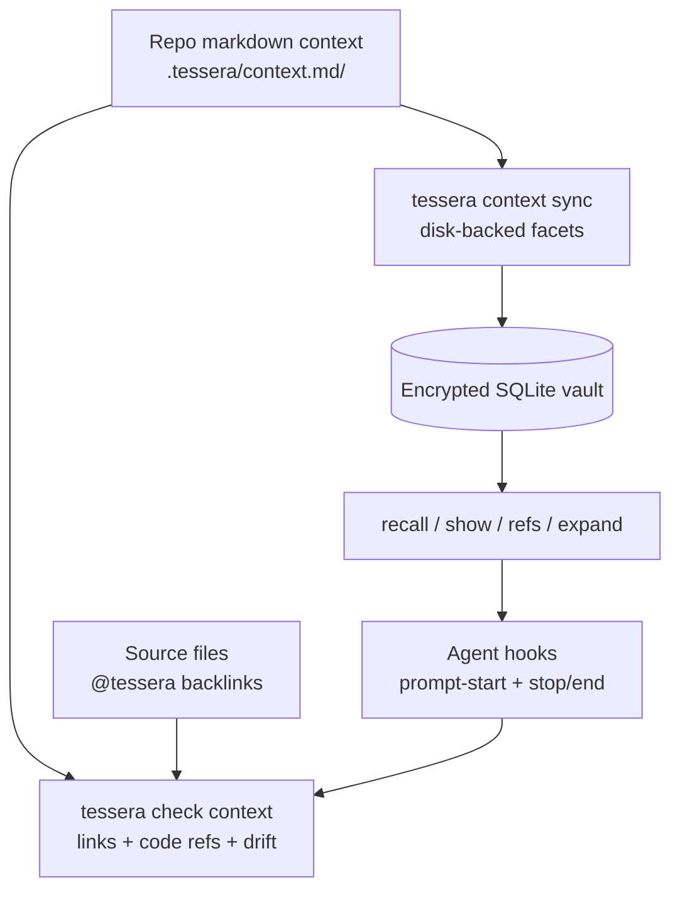

# Tessera — Project Context Layer

**Status:** Proposed post-v0.5 work
**Date:** May 2026
**Owner:** Tom Mathews
**License:** Apache 2.0

---

## Purpose

Tessera already stores durable user and agent context in an encrypted SQLite vault. The missing layer is repo-local project context that is easy for humans to review, easy for agents to navigate, and mechanically tied to source code.

The useful pattern from markdown knowledge-graph tools is not the storage backend. It is the workflow:

- write project knowledge as linked markdown sections
- validate every link and backlink
- attach requirements/specs/design notes to source code
- expose section navigation through CLI and MCP
- run checks in agent lifecycle hooks so context drift is visible

Tessera should adopt that workflow as an adapter over facets, not replace the vault.

## Design Position

The project-context layer is optional and repo-local. A repository may carry a directory such as `.tessera/context.md/` or `tessera.md/`. Sections in that directory sync into Tessera as disk-backed facets with stable section IDs, source hashes, and file provenance.



The vault remains the source of truth for retrieval, auth, sync, audit, and cross-tool access. Markdown is the authoring and review surface.

## Facet Mapping

| Markdown content | Tessera facet |
| --- | --- |
| Architecture and design notes | `project` |
| Coding procedures and operational recipes | `workflow` or `skill` |
| Test specs and delivery gates | `verification_checklist` |
| Agent operating notes | `agent_profile` or `project` |
| Synthesized deep project documents | `compiled_notebook` |

The adapter should preserve the existing `skill` disk-sync behavior and generalize only the reusable parts: disk path, source hash, sync direction, and collision handling.

## Source References

Project-context facets should support structured source references:

```json
{
  "source_refs": [
    {
      "path": "src/tessera/retrieval/pipeline.py",
      "symbol": "recall",
      "line": 78,
      "ref_kind": "implements"
    }
  ]
}
```

Source comments provide backlinks:

```python
# @tessera: [[project#Retrieval Pipeline]]
```

```ts
// @tessera: [[skill#Release Checklist]]
```

Scanning belongs in CLI/check-time workflows. The daemon should store indexed references but must not parse arbitrary source files during the recall hot path.

## Playbook integration

Disk-backed project-context sections are first-class Playbook sources. A section that opts into a compile target tags its frontmatter metadata exactly the way a vault-only `agent_profile`, `project`, `skill`, or `verification_checklist` facet does (see `docs/system-design.md §Compile target metadata contract`):

```json
{
  "compile_into": ["swcr_design_brief"],
  "compile_role": "primary_source",
  "compile_priority": 80,
  "source_refs": [
    {
      "path": "src/tessera/retrieval/pipeline.py",
      "symbol": "recall",
      "line": 78,
      "ref_kind": "implements"
    }
  ]
}
```

The disk-sync writes the section into the vault as an ordinary disk-backed facet; from then on the existing `tessera playbook sources <target>` enumeration, `tessera playbook scaffold` brief, and `register_compiled_artifact` write path treat the section like any other tagged source. A repo can therefore stage Playbook inputs in reviewable Markdown, sync them once, and compile through the same V0.5 CLI without a parallel ingestion path.

Compile target descriptors (`workflow` or `skill` facets carrying `target` / `task` / `artifact_type` / `quality_bar`) may also live as project-context sections. When two repos sync into the same vault and both define a descriptor for the same `target`, the duplicate is caught by `tessera check context`, not by the daemon write path — duplicate-target detection is a context-check concern per the V0.5 plan.

`source_refs` on project-context sections follow the same compact `{path, section, symbol, line, ref_kind}` convention as Playbook source refs and `metadata.field_provenance.source_refs`. Validation that the path resolves and the section/symbol exists runs at check time, so the daemon never reads arbitrary source files during recall.

## Integrity Checks

`tessera check context` should fail on drift and ambiguity:

| Check | Failure |
| --- | --- |
| Wiki links | target section/facet does not exist |
| Short references | more than one target matches |
| Source backlinks | `@tessera` comment points at no known section/facet |
| Required code mention | checklist/spec section has no source backlink |
| Disk-backed facet hash | file content and vault metadata diverge |
| Unresolved source refs | `metadata.source_refs[].path` (or `field_provenance.source_refs[].path`) does not resolve to a tracked file, or the named `section`/`symbol` is missing |
| Stale compiled artifacts | `compiled_artifacts.is_stale = 1` for any artifact whose target the repo claims, with the cascade cause from `compiled_artifact_marked_stale` audit rows |
| Duplicate compile targets | two `workflow`/`skill` descriptors (vault or disk-backed) carry the same `target` |
| Compile target with no sources | a registered descriptor exists but `list_compile_sources(target)` is empty |
| Field provenance subset | `metadata.field_provenance.<field>.source_facets` references a ULID not present in the parent `compiled_artifacts.source_facets` list |
| Compiled artifact target match | `compiled_notebook.metadata.target` does not match a known descriptor (orphan artifact) |
| Leading summary | section lacks a short first paragraph for previews |

The Playbook-specific rows (unresolved source refs, stale artifacts, duplicate targets, empty source lists, field-provenance subset, orphan artifact) are the v0.6 extension of the V0.5 storage-only contract. The daemon stores everything; the check command is where path resolution, duplicate detection, and provenance subset validation finally run, because only at check time can the CLI walk both the vault metadata and the on-disk repo together.

Checks should provide markdown output for humans and JSON output for hooks. The JSON shape distinguishes per-artifact failures (`compiled_artifact_external_id`, `target`, `field`) so an agent loop can repair a single offending Playbook without re-checking the whole vault.

## Explicit Expansion

Semantic recall is useful when the user does not know the exact handle. Explicit references are useful when the user does.

`tessera expand` should resolve `[[...]]` references in a prompt against:

- facet external IDs
- skill names
- people aliases
- disk-backed project-context section IDs
- compiled-artifact IDs
- compile target identifiers (the `target` key on a descriptor)

The first three handle shapes are unprefixed and resolved by namespace heuristics (ULID → facet, slug → skill, name → person alias). Compiled artifacts and Playbook targets get explicit prefixes so the rewrite is unambiguous when a target name happens to look like a skill slug:

```text
[[compiled:01J0ABCD…]]      # exact compiled-artifact ULID
[[compiled:swcr_design_brief]] # latest fresh artifact for that target
[[playbook:release]]        # alias for the same lookup, target-first reading
```

The two prefixes resolve identically; `playbook:` reads naturally in user-facing prompts ("expand `[[playbook:release]]` before drafting"), while `compiled:` reads naturally when piping a specific ULID. Resolution rules:

- A `[[compiled:<target>]]` or `[[playbook:<target>]]` handle resolves to the most recent non-stale artifact for that target. If the only candidate is stale, expansion fails loudly with the artifact's `external_id` and the bundle-level `compiled_artifact_stale` warning from V0.5-P7; it does not silently fall back to raw recall.
- A `[[compiled:<external_id>]]` handle resolves to that exact artifact regardless of staleness. If the artifact is stale, expansion still succeeds but the bounded context block carries `is_stale=true` so the caller cannot accidentally trust it.
- Unknown targets and unknown ULIDs fail with the same exit code as any other unresolved handle. Ambiguity is impossible for ULIDs (unique by construction) and impossible for targets after the duplicate-target check passes.

Unresolved or ambiguous references should fail loudly. The result should include the rewritten prompt plus a bounded context block with resolved IDs, summaries, source locations, and warnings.

## Agent Hooks

`tessera connect <client> --hooks` can wire supported clients into a maintenance loop:

- Prompt-start hook: expand explicit refs, run bounded recall on the user's intent, inject source-tagged context.
- Stop/end hook: run `tessera check context`, warn or block on drift, and report exact repair targets.

Hooks must preserve non-Tessera entries in client config files. Tessera should not become an agent runtime; the runtime decides how to use injected context and how to repair failures.

## Non-Goals

- Do not replace the encrypted SQLite vault with markdown files.
- Do not make markdown mandatory for ordinary Tessera use.
- Do not parse source code in the daemon hot path.
- Do not auto-edit source files or auto-create missing docs from checks.
- Do not require cloud embedding APIs for project-context search.
- Do not create an in-process plugin API.

## Release Placement

This is post-v0.5 work. It should happen before broad memory-policy UX work if no stronger dogfood trigger exists for row-merge or temporal retrieval, because it improves the daily coding loop while reusing existing facets, MCP/REST surfaces, and audit discipline.
