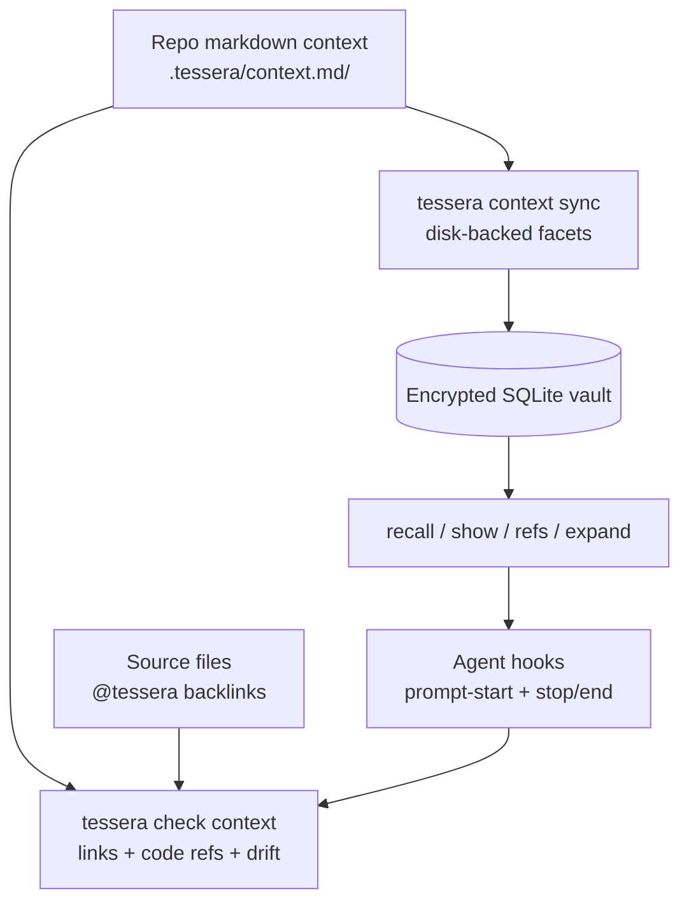

# Tessera — Project Context Layer

**Status:** Proposed post-v0.5 work
**Date:** May 2026
**Owner:** Tom Mathews
**License:** Apache 2.0

---

## Purpose

Tessera already stores durable user and agent context in an encrypted SQLite vault. The missing layer is repo-local project context that is easy for humans to review, easy for agents to navigate, and mechanically tied to source code.

The useful pattern from markdown knowledge-graph tools is not the storage backend. It is the workflow:

- write project knowledge as linked markdown sections
- validate every link and backlink
- attach requirements/specs/design notes to source code
- expose section navigation through CLI and MCP
- run checks in agent lifecycle hooks so context drift is visible

Tessera should adopt that workflow as an adapter over facets, not replace the vault.

## Design Position

The project-context layer is optional and repo-local. A repository may carry a directory such as `.tessera/context.md/` or `tessera.md/`. Sections in that directory sync into Tessera as disk-backed facets with stable section IDs, source hashes, and file provenance.



The vault remains the source of truth for retrieval, auth, sync, audit, and cross-tool access. Markdown is the authoring and review surface.

## Facet Mapping

| Markdown content | Tessera facet |
| --- | --- |
| Architecture and design notes | `project` |
| Coding procedures and operational recipes | `workflow` or `skill` |
| Test specs and delivery gates | `verification_checklist` |
| Agent operating notes | `agent_profile` or `project` |
| Synthesized deep project documents | `compiled_notebook` |

The adapter should preserve the existing `skill` disk-sync behavior and generalize only the reusable parts: disk path, source hash, sync direction, and collision handling.

## Source References

Project-context facets should support structured source references:

```json
{
  "source_refs": [
    {
      "path": "src/tessera/retrieval/pipeline.py",
      "symbol": "recall",
      "line": 78,
      "ref_kind": "implements"
    }
  ]
}
```

Source comments provide backlinks:

```python
# @tessera: [[project#Retrieval Pipeline]]
```

```ts
// @tessera: [[skill#Release Checklist]]
```

Scanning belongs in CLI/check-time workflows. The daemon should store indexed references but must not parse arbitrary source files during the recall hot path.

## Integrity Checks

`tessera check context` should fail on drift and ambiguity:

| Check | Failure |
| --- | --- |
| Wiki links | target section/facet does not exist |
| Short references | more than one target matches |
| Source backlinks | `@tessera` comment points at no known section/facet |
| Required code mention | checklist/spec section has no source backlink |
| Disk-backed facet hash | file content and vault metadata diverge |
| Compiled artifact sources | source facet changed and artifact is stale |
| Leading summary | section lacks a short first paragraph for previews |

Checks should provide markdown output for humans and JSON output for hooks.

## Explicit Expansion

Semantic recall is useful when the user does not know the exact handle. Explicit references are useful when the user does.

`tessera expand` should resolve `[[...]]` references in a prompt against:

- facet external IDs
- skill names
- people aliases
- disk-backed project-context section IDs
- compiled-artifact IDs

Unresolved or ambiguous references should fail loudly. The result should include the rewritten prompt plus a bounded context block with resolved IDs, summaries, source locations, and warnings.

## Agent Hooks

`tessera connect <client> --hooks` can wire supported clients into a maintenance loop:

- Prompt-start hook: expand explicit refs, run bounded recall on the user's intent, inject source-tagged context.
- Stop/end hook: run `tessera check context`, warn or block on drift, and report exact repair targets.

Hooks must preserve non-Tessera entries in client config files. Tessera should not become an agent runtime; the runtime decides how to use injected context and how to repair failures.

## Non-Goals

- Do not replace the encrypted SQLite vault with markdown files.
- Do not make markdown mandatory for ordinary Tessera use.
- Do not parse source code in the daemon hot path.
- Do not auto-edit source files or auto-create missing docs from checks.
- Do not require cloud embedding APIs for project-context search.
- Do not create an in-process plugin API.

## Release Placement

This is post-v0.5 work. It should happen before broad memory-policy UX work if no stronger dogfood trigger exists for row-merge or temporal retrieval, because it improves the daily coding loop while reusing existing facets, MCP/REST surfaces, and audit discipline.
