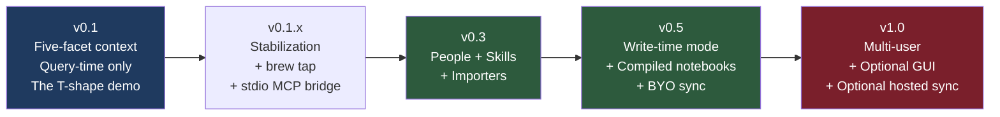
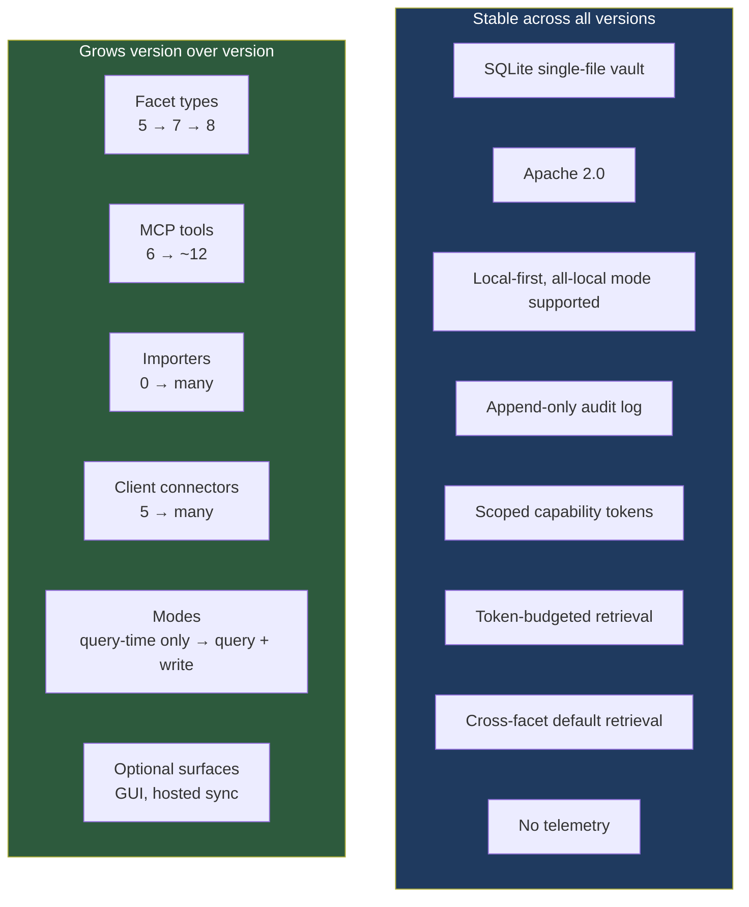

# Tessera — Release Specification

> *A portable context layer for AI tools, paced by solo-dev velocity and real-user signal.*

**Status:** Draft (post-reframe)
**Date:** April 2026
**Owner:** Tom Mathews
**License:** Apache 2.0

---

## Versioning posture

Semantic versioning. Pre-1.0 means breaking changes between minor versions are acceptable; the migration path is explicit and reviewable. Post-1.0, breaking changes require a major version bump and a documented migration.

A version ships only when its Definition of Done is fully green. Partial v0.3 is not v0.3 — it stays v0.1.x until v0.3 actually meets its bar.

## Roadmap at a glance



Timeline estimates, paced by solo-dev evening and weekend velocity:

| Version | Estimated ship window | Bar |
|---|---|---|
| v0.1 | 6–10 weeks from start | The T-shape cross-facet synthesis demo works end-to-end |
| v0.1.x | 4 weeks of stabilization | 5+ real users (not Tom) successfully complete the demo without live help |
| v0.3 | 3 months after v0.1 | People + Skills facets in real use; two importers shipped |
| v0.5 | 6 months after v0.3 | Write-time compilation is useful for a real vertical-depth topic |
| v1.0 | When v0.5 has 100+ active vaults in the wild | Multi-user works; optional GUI if demanded |

The windows above are estimates, not commitments. A version ships when its Definition of Done is green, not when the calendar says so. The discipline is shipping a tight v0.1 that nails the T-shape demo, not hitting a date. Definition-of-Done items in each release section below are hard gates: every checkbox must be green before the version ships.

---

## v0.1 — Five-facet context, query-time only, the T-shape demo

**The bar.** A fresh install on a clean machine, under 10 minutes including Ollama setup, demonstrates the T-shape cross-facet synthesis story. Tom teaches Claude his LinkedIn writing rules and anneal project context. Tom opens ChatGPT. ChatGPT drafts a LinkedIn post that feels like Tom wrote it — voice, workflow, project details, no-emoji preference — all without configuring ChatGPT separately.

### Scope

**Five facets shipping**
- `identity` — stable-for-years user facts
- `preference` — stable-for-months behavioral rules
- `workflow` — procedural patterns
- `project` — active work context
- `style` — writing voice samples

All five are query-time only. The `mode` field in the schema is populated (`query_time`) but never exposed to users.

**Six MCP tools shipping**
- `capture(content, facet_type, source_tool?, metadata?)`
- `recall(query_text, facet_types? = all readable facets, k=10, requested_budget_tokens?)` — **cross-facet by default**
- `show(external_id)`
- `list_facets(facet_type, limit=20, since?)`
- `stats()`
- `forget(external_id, reason?)`

**CLI**
- `tessera init` — vault + daemon + default user
- `tessera daemon [start|stop|status|logs]`
- `tessera connect <tool>` — generates token, writes MCP config
- `tessera disconnect <tool>`
- `tessera tokens [list|create|revoke]`
- `tessera capture "..." [--facet-type X]`
- `tessera recall "..." [--facet-types X,Y]`
- `tessera show <external_id>`
- `tessera forget <external_id>`
- `tessera stats`
- `tessera config [get|set] <key> [<value>]`
- `tessera models [list|set|test] <slot>`
- `tessera doctor` — end-to-end health check
- `tessera vault [reembed|prune-old-models|vacuum]`
- `tessera export --format json|md|sqlite [--out PATH]`

**Daemon**
- Single async Python process
- HTTP MCP server on `127.0.0.1:5710`
- Unix socket for CLI control
- Auto-start via `launchd` (macOS) + systemd user unit (Linux)

**Storage**
- Single-file SQLite vault (`~/.tessera/vault.db`)
- `sqlite-vec` for vectors (per-model vec tables)
- FTS5 for BM25
- Append-only audit log
- Schema includes `mode` column + empty `compiled_artifacts` table (v0.5 hooks)

**Model adapters** (superseded at v0.4 per [ADR-0014](adr/0014-onnx-only-stack.md))
- Three slots: embedder, extractor (optional), reranker
- v0.1–v0.3 reference: Ollama (embedder), OpenAI (cloud embedder), sentence-transformers (reranker), Cohere (cloud reranker). All-local mode (Ollama only) was the default; cloud adapters were opt-in.
- v0.4 onward: fastembed (ONNX Runtime) for both embedder and reranker, fully in-process. No cloud adapters ship; Ollama and torch are no longer dependencies.

**Retrieval pipeline**
- Hybrid candidate generation (vector + BM25) per facet type in scope
- Reciprocal Rank Fusion merge per facet type
- **SWCR topology weighting for cross-facet coherence** — the load-bearing differentiator
- Cross-encoder rerank (mandatory; fallback warns to audit, never silent)
- MMR diversification per facet
- Token budget distributed proportionally across facets in scope

**Capability tokens**
- Per-tool, per-scope, per-facet-type
- Token shown once; stored as `sha256(token)` only
- Revocable, audit-logged

**Client connectors**
- Claude Desktop
- Claude Code
- Cursor
- Codex (`~/.codex/config.toml`)
- ChatGPT Developer Mode is deferred to v0.1.x until HTTPS, auth-mode, and canonical HTTP MCP compatibility are implemented.

### Definition of Done for v0.1

v0.1 is a **developer preview**. It is not a general release until clean-VM install and external-user demo gates pass.

Per-item evidence tracked in `docs/v0.1-dod-audit.md` (last audit: 2026-04-24 at commit `32b7395`). Checkboxes below reflect audit state at that commit.

- [ ] Fresh install on clean macOS, Ubuntu, Windows: init → activate fastembed model → connect Claude Desktop or Claude Code → capture preference/workflow/project/style → `recall` returns coherent cross-facet bundle → fresh client session drafts in Tom's voice using right structure. **Under 10 minutes end-to-end** (excluding the one-time fastembed weight download). *(Pending: cross-platform smoke, runbook in `docs/smoke-test-v0.4rc1.md`. ChatGPT Developer Mode is v0.1.x.)*
- [x] All-local mode (no cloud keys) passes the same demo. *(After ADR-0014 there is no non-local mode at all; cloud adapters were removed entirely.)*
- [x] `tessera doctor` correctly diagnoses: missing fastembed weights, port 5710 conflict, broken `sqlite-vec`, missing model, vault schema mismatch, expired token, empty facet types. *(All seven checks in `src/tessera/daemon/doctor.py`, tests in `tests/integration/test_daemon_doctor_vault.py` + `tests/unit/test_daemon_doctor.py`.)*
- [x] Test coverage ≥ 80% on `vault/`, `retrieval/`, `adapters/`, `auth/`, `daemon/`. *(Critical-dir roll-up 91.58% at audit commit.)*
- [ ] MCP `recall` latency tiers under real adapters. The historical numbers below were measured against the v0.1–v0.3 stack (Ollama `nomic-embed-text` + sentence-transformers `cross-encoder/ms-marco-MiniLM-L-6-v2`, `rerank_candidate_limit=20`, 100 trials after a discarded warm-up call), on the reference hardware baseline: **MacBook Pro M1 Pro (10-core CPU, 16-core GPU), 16 GB RAM, macOS 15.x, daemon idle except for the test query**. The v0.4 fastembed stack is expected to land in the same envelope (in-process ONNX removes the Ollama HTTP round-trip; the cross-encoder layer count goes L-6 → L-12, adding ~10–20 ms but eliminating torch warmup variance). A re-measurement against the v0.4 stack is a v0.4 → v0.5 tracking item.

  | Tier | Vault size | p50 | p95 | p99 | Evidence (v0.1–v0.3 stack) |
  |------|-----------:|----:|----:|----:|----------|
  | Demo-day | ≤ 500 facets | < 500 ms | < 1000 ms | < 1500 ms | `docs/benchmarks/B-RET-2-recall-latency/results/20260423T215936Z.json` (404 / 574 / 674 ms) |
  | Steady-state | 10K facets | < 800 ms | < 1000 ms | < 1500 ms | `docs/benchmarks/B-RET-2-recall-latency/results/20260423T182517Z.json` (CPU tier, 730/778/897 ms) |
  | Steady-state (opt-in accelerator) | 10K facets | < 800 ms | < 1000 ms | < 1500 ms | `docs/benchmarks/B-RET-2-recall-latency/results/20260423T212745Z.json` (MPS tier, 710/832 ms; p99 dominated by one upstream stall) |

  Rationale for the envelope: the 500 ms p50 @ 10K ceiling set pre-measurement did not account for the pipeline's structural floor — query-embed cost (~40–80 ms under Ollama HTTP, expected ~10–30 ms under fastembed's in-process ONNX), dense vec linear scan (~80–150 ms at 10K × 768-dim on sqlite-vec), SWCR reweight + MMR + audit (~60–100 ms), cross-encoder rerank at k=20 (~80–100 ms). The demo-day tier keeps the original 500 ms promise for the first-user experience the T-shape demo runs against; the steady-state tier is the year-two scaling promise.
- [x] SWCR coherence check: cross-facet `recall` returns at least one facet from each type in scope (when candidates exist) — proven by integration test with realistic vault. *(`tests/integration/test_retrieval_pipeline.py` + B-RET-1 quality evidence at `docs/benchmarks/B-RET-1-swcr-ablation/results/20260423T220323Z.json`.)*
- [x] **Honesty on empty recall.** A `recall` against an empty or low-signal vault returns an empty bundle with a populated `degraded_reason`. The system never fabricates or pads context to fill a query that has no matching facets. *(`tests/integration/test_recall_honesty.py`.)*
- [x] Token budget never exceeded in any test case. *(`tests/unit/test_retrieval_budget.py`, `tests/integration/test_mcp_tool_surface.py::test_recall_clamps_over_budget_request`.)*
- [x] Zero outbound network calls except those triggered by user/tool intent. Verified by source review and CI grep check. *(CI `no-outbound` job + `scripts/no_telemetry_grep.sh`.)*
- [ ] One real user (not Tom) successfully completes the T-shape demo with no live help, recorded. *(Pending-external; P14 task 6. Hard release blocker.)*
- [ ] Documentation: README, pitch, system-overview, system-design, release-spec, SWCR spec, threat model, migration contract, non-goals, observability/determinism spec, 10+ ADRs. *(Every listed doc present; README post-reframe rewrite tracked under P15 task 4.)*

### What v0.1 explicitly does NOT ship

| Excluded from v0.1 | Reason | Target |
|---|---|---|
| People facet | Needs usage to shape | v0.3 |
| Skills facet | Needs usage to shape | v0.3 |
| Write-time mode / compiled notebooks | Vertical-depth work; needs v0.1 users to shape the compiler | v0.5 |
| Importers (ChatGPT, Claude, Obsidian, Gmail) | Each is a small project | v0.3 |
| Episodic temporal queries | Not needed for the horizontal touch | v0.5 if ever |
| BYO cloud sync | Architecturally simple but adds surface | v0.5 |
| Web/desktop UI | Violates "the product disappears" | v1.0 if ever |
| Multi-user vaults / shared namespaces | Permission complexity | post-1.0 |
| Hosted sync service | Solo-dev cannot run user-facing infra | v1.0 if ever |
| Auto-capture (clipboard, screen, keylog) | **Never.** Ideology bar. | never |

---

## v0.1.x — Stabilization

The releases between v0.1 and v0.3 are stabilization, not feature work. The bar to graduate to v0.3 is real-user signal.

### Scope

- ~~Stdio MCP bridge for clients that don't speak HTTP MCP cleanly.~~ **Shipped** in the developer-UX overhaul (PR #23, commit `248b719`). Implementation: `src/tessera/daemon/stdio_bridge.py` + `tessera stdio` subcommand in `src/tessera/cli/__main__.py`. Claude Desktop uses it natively; `tessera connect claude-desktop` wires the stdio bridge into `claude_desktop_config.json` without the third-party `mcp-remote` shim.
- Homebrew formula for macOS. Delivery path TBD — either a dedicated `Mathews-Tom/homebrew-tessera` tap or a single-repo tap against the Tessera repo itself. The canonical formula lives in-tree at `packaging/homebrew/Formula/tessera.rb` either way; it's installable today via `brew install --build-from-source` or a direct raw-URL install while the delivery decision settles.
- **Linux: `pip install --pre tessera-context` is the v0.1.x install path.** Native `.deb` and `.rpm` packaging is not in scope. Decision recorded 2026-04-25: the adoption signal required to justify the `nfpm` / `fpm` build pipeline (plus the apt/yum repo hosting that makes `apt install tessera` actually work) isn't present at v0.1.x. Any Linux user with Python 3.12 can install via PyPI today; users without Python 3.12 are currently outside the v0.1 target audience. Re-evaluate at v0.3 against real Linux adoption data.
- Bug fixes from real-user reports
- Performance work surfaced by real vaults
- Documentation expansion (real-world examples, troubleshooting)
- At least one additional client connector written from a user request

### Definition of Done for v0.1.x

- [ ] 5+ real users (not Tom, not direct collaborators) have successfully run the T-shape demo and shared feedback
- [ ] 1+ user reports running Tessera continuously for 4+ weeks
- [ ] No P0 bugs open in the issue tracker
- [ ] Setup time for a non-developer technical user < 15 minutes from `pip install` to working demo
- [ ] 3+ different AI tools verified working (Claude Code, Cursor, ChatGPT Dev Mode minimum)
- [ ] Tom has dogfooded Tessera for at least 60 days without regression

---

## v0.3 — People + Skills + Importers

**The bar.** The user's context layer expands to cover relationships and learned procedures. Existing AI conversation history (from ChatGPT and Claude exports) becomes importable and queryable. People and skills prove their design against real usage. Design rationale is recorded in `docs/adr/0012-v0-3-people-and-skills-design.md`.

### Scope

**Schema v3 (additive over v2)**
- New nullable `disk_path` column on `facets`, partial-unique-indexed per agent for live skill rows.
- New `people` table — separate from `facets` — carrying canonical name, alias array, and per-agent uniqueness.
- New `person_mentions` link table joining facets to people with confidence scores and `ON DELETE CASCADE` on both sides.
- The schema-level `facet_type` CHECK already admitted `person`, `skill`, `compiled_notebook` at v2; v0.3 unlocks `skill` for writes (people are stored in `people`, not as facets — see ADR 0012).

**New facet types activated for writes**
- `skill` — user-authored procedure markdown, optionally synced to disk. Stored as a facet with `metadata = {name, description, active}` and the `disk_path` column when synced.

**People surface (not a facet type)**
- People live in their own `people` rows, not in `facets`. Rationale: relationship-graph mutability (alias merges, splits) fights content-hash dedup; per-row foreign keys are cleaner than `json_extract` joins. ADR 0012 records the alternative and the rejection reasons.

**New MCP tools**
- `learn_skill(name, description, procedure_md)` — write scope on `skill`
- `get_skill(name)` — read scope on `skill`, returns `null` when no live match
- `list_skills([active_only=true, limit=50])` — read scope on `skill`
- `resolve_person(mention)` — read scope on `person`, returns `(matches, is_exact)` candidate list
- `list_people([limit=50, since?])` — read scope on `person`

**New CLI**
- `tessera skills {list|show|sync-to-disk|sync-from-disk}` — list/show via HTTP MCP; sync via direct vault access
- `tessera people {list|show|merge|split}` — list/show via HTTP MCP; merge/split via direct vault access
- `tessera import {chatgpt|claude} <path>` — direct-vault batch import

**Importers (two ship at v0.3)**
- ChatGPT export (`conversations.json` from a ChatGPT data export). Walks the active-branch through the export's mapping graph; falls back to a `create_time` sort when `current_node` is missing or the parent chain is broken.
- Claude export (`conversations.json` from a Claude data export). Walks the flat `chat_messages` array; handles both the older `text` field and the newer `content` block array shape.
- Stretch: Obsidian vault, email mbox, Notion export.

Importers backfill the **v0.1 facet types** — `identity | preference | workflow | project | style` — from exported conversation history. They do not write to `skill`: skills are authored by the user via the `learn_skill` MCP tool, not derived from past conversations. Person-mention auto-extraction during import is documented future work — heuristic NER without calibration data over-engineers a problem real-user mistakes haven't yet justified (ADR 0012 §Negative).

### Definition of Done for v0.3

Per-item status is annotated below. Implementation lands in the v0.3 commit series; external-user verification gates lift when v0.1.x graduates and v0.3 dogfooding has produced signal.

- [x] Schema v3 migration is additive, idempotent, and resume-safe. *(`src/tessera/migration/runner.py:_V2_TO_V3_STEPS`; `tests/unit/test_migration_runner.py`.)*
- [x] Skill round-trip is wired end-to-end at the protocol layer: `learn_skill` writes a skill, `get_skill` retrieves it across MCP clients with read scope on `skill`. *(`src/tessera/mcp_surface/tools.py::learn_skill`/`get_skill`; `tests/integration/test_mcp_tool_surface.py`.)* External cross-client demo (Claude → Cursor → fresh session) is **pending external verification**.
- [x] Skill disk sync: `tessera skills sync-to-disk` writes `.md` files; edits sync back via `sync-from-disk`. *(`src/tessera/vault/skills.py::sync_to_disk`/`sync_from_disk`; `src/tessera/cli/skills_cmd.py`; `tests/unit/test_skills.py::test_round_trip_to_disk_then_back`.)*
- [x] ChatGPT importer parses `conversations.json` shape, dedups on rerun, handles multimodal content blocks and the active-branch / fallback walker paths. *(`src/tessera/importers/chatgpt.py`; `tests/unit/test_importers_chatgpt.py`.)* 5K+ conversation import is **pending real-export run**.
- [x] Claude importer parses `chat_messages` shape, handles both legacy `text` and newer `content` block schemas. *(`src/tessera/importers/claude.py`; `tests/unit/test_importers_claude.py`.)* Real-export run is **pending**.
- [x] Person resolution returns single-match `is_exact=True` for canonical / alias hits and a candidate list for fuzzy matches. Auto-pick is deliberately not wired (ADR 0012 §Conservative resolution). *(`src/tessera/vault/people.py::resolve`; `tests/unit/test_people.py::test_resolve_*`; `tests/integration/test_mcp_tool_surface.py::test_resolve_person_*`.)*
- [x] `recall` includes top-K skills in cross-facet bundles by default; people surface via the dedicated `resolve_person` tool. *(`src/tessera/daemon/dispatch.py::_DEFAULT_RECALL_TYPES`; `tests/unit/test_daemon_dispatch_defaults.py`. ADR 0012 records the people-as-rows decision.)*
- [ ] **Cross-platform clean-install smoke (subsumes v0.1 DoD item 1) — v0.3.0rc1 → v0.3.0 GA stabilization gate, not an rc1 ship gate.** Recorded clean-VM walkthrough on macOS, Ubuntu, and Windows: `pip install --pre tessera-context==0.3.0rc1` → `ollama pull nomic-embed-text` → `tessera init` → `tessera daemon start` → `tessera connect claude-desktop` (or platform equivalent) → capture → recall. Decision 2026-04-26: rc1 ships on internal evidence (CI green, schema v3 migration covered by `tests/unit/test_migration_runner.py`, the v0.3 surface tested end-to-end via `tests/integration/test_mcp_tool_surface.py`); cross-platform recordings happen during the stabilization window between rc1 and GA, exactly as v0.1 DoD items 1 and 9 rode along the v0.1.x → v0.5 window. Blocking rc1 publication on out-of-session VM coordination is the failure mode the 2026-04-25 deferral was written to avoid. *(Pending — external clean-VM coordination per `docs/smoke-test-v0.4rc1.md`.)*
- [ ] **v2 → v3 migration verification on a real rc2 vault — v0.3.0rc1 → v0.3.0 GA stabilization gate.** Smoke run pre-seeds each clean VM with a populated rc2 vault (≥ 50 facets across all five v0.1 types, sqlcipher-encrypted), installs v0.3.0rc1, launches the daemon, and confirms (a) `_migration_steps` rows for the v3 target, (b) `disk_path` column visible on `facets`, (c) `people` and `person_mentions` tables created, (d) every pre-migration facet count preserved, (e) `tessera doctor` green. *(Implementation Green at `src/tessera/migration/runner.py:_V2_TO_V3_STEPS`, exercised by `tests/unit/test_migration_runner.py`; the open gate is real-vault verification on each platform during stabilization.)*
- [ ] **One external user completes the T-shape demo unaided, recorded (carry-over from v0.1 DoD item 9) — v0.3.0rc1 → v0.3.0 GA stabilization gate.** Independent of platform; identical role to its v0.1 counterpart. *(Pending — seeded T-shape engineer recruit.)*
- [ ] Tom has dogfooded Tessera with real ChatGPT/Claude import for 30+ days — v0.3.0rc1 → v0.3.0 GA stabilization gate. *(Pending — external dogfooding gate.)*

---

## v0.5 — Write-time mode + Compiled notebooks + BYO sync

**The bar.** Tessera becomes useful for the vertical depth of the T-shape — long-running research topics, evolving deep domain thinking. Write-time compilation produces Karpathy-style synthesized artifacts. BYO cloud sync makes multi-machine use practical.

### Scope

**New facets activated**
- `compiled_notebook` — write-time compiled artifact. Sources: user-tagged `project` and `skill` facets. Output: synthesized markdown artifact in `compiled_artifacts` table.
- `agent_profile` (V0.5-P2, ADR 0017) — recallable description of an autonomous worker: `purpose`, `inputs`, `outputs`, `cadence`, `skill_refs`, optional `verification_ref`. Linked to its authentication principal via the new nullable `agents.profile_facet_external_id` FK. Three new MCP tools (`register_agent_profile`, `get_agent_profile`, `list_agent_profiles`) and parallel REST routes ship under `read:agent_profile` / `write:agent_profile` scopes. `recall` defaults include `agent_profile` so the SWCR cross-facet bundle answers "what is the digest agent doing?" by surfacing the profile alongside related project / skill / verification facets without an explicit filter.
- `verification_checklist` and `retrospective` (V0.5-P3, ADR 0018) — the pre-delivery gate an agent runs and the post-run record of how it went. Three new MCP tools (`register_checklist`, `record_retrospective`, `list_checks_for_agent`) and parallel REST routes ship under `write:verification_checklist`, `write:retrospective`, and `read:verification_checklist` scopes. SWCR augments the candidate set with the most recent N retrospectives whose `agent_ref` matches an `agent_profile` candidate (default `retrospective_window=3`); the augmentation is closed-form, deterministic, and filtered by the calling agent's id. The `automation` type stays reserved in the v3 → v4 schema CHECK extension; activation lands in V0.5-P5.

**Write-time compilation**
- Compilation agent reads source facets, synthesizes narrative artifact
- Scheduled or on-demand
- Source mutations mark artifact stale; next run rebuilds
- User opts in per-project: `tessera projects compile <name> --schedule daily`

**Episodic temporal upgrades** (if user signal warrants)
- Time-aware retrieval for projects ("what was I thinking about anneal two weeks ago")
- Episode segmentation for related captures

**BYO cloud sync**
- S3-compatible target (S3, B2, Tigris, Cloudflare R2, MinIO)
- End-to-end encrypted at rest in cloud (key stays local)
- Conflict resolution: last-writer-wins on facets; manual merge for people

**New MCP tools**
- `recall_notebook(topic)` — read compiled artifact
- `compile(project_external_id)` — manual trigger
- `recall_temporal(time_range, query?)` — if shipped

**New CLI**
- `tessera sync [setup|status|push|pull|conflicts]`
- `tessera compile [list|run|schedule|stale]`
- `tessera notebooks [list|show|export]`

**v0.5 ships write-time as a new facet type, not as a per-facet mode toggle.** Users tag a `project` or `skill` as vertical-depth; the compilation agent produces a new `compiled_notebook` facet with `mode=write_time` from those source facets. The source facets stay `mode=query_time`. There is no user-facing switch that converts an existing `preference`, `workflow`, `project`, or `style` row from `query_time` to `write_time` — the `mode` column records the row's production method, not a user choice. A per-facet user-visible mode toggle on existing facet types is not a v0.5 commitment; if real-user signal calls for one after v0.5, it becomes a later decision.

### Definition of Done for v0.5

- [ ] Tom's dissertation research topic ships as a `compiled_notebook` and produces genuinely useful synthesized output
- [ ] Compilation is idempotent and resumable; can interrupt mid-run without corruption
- [ ] Stale detection correctly identifies when source facets have changed
- [ ] **Audit-chain ship-gate (V0.5-P8, ADR 0021).** `tessera audit verify` returns exit 0 on a populated vault; the seven security tests (genesis, append, deletion-detect, modify-detect, reorder-detect, insert-detect, full-walk-clean) pass; the `audit-chain-determinism` and `audit-chain-single-writer` CI gates are green on the release commit; public language about the chain stays inside the ADR 0021 §Security claim — exact boundary. Hard ship-gate before V0.5-P4 reaches users — write-time compilation does not merge to `main` until this row is checked.
- [ ] BYO sync round-trip: vault → S3-compatible bucket → restore on second machine → identical state, **and `tessera audit verify` succeeds on the restored vault**
- [ ] Sync handles 50K+ facets without blocking the daemon
- [ ] Encryption: data at rest in cloud is unreadable without local key (verified by attempting read with key absent)
- [ ] `recall` transparently surfaces compiled artifacts when relevant, marks stale ones in response metadata
- [ ] 1+ user reports running multi-machine sync continuously for 30+ days
- [ ] Tom has dogfooded write-time compilation for his actual research for 60+ days

---

## v1.0 — Multi-user + Optional GUI + Optional hosted sync

**The bar.** Tessera is production-ready. Multiple users can share a vault with proper permission boundaries. An optional GUI exists for users who want it (CLI remains primary). Optional hosted sync exists for users who don't want to run their own S3.

### Scope

**Multi-user**
- Multiple users in one vault (household, team, mentoring pair)
- Per-user-per-facet-type scopes
- Shared namespaces for facts both users want (e.g., household preferences)
- Audit log attributes per-user activity

**Optional desktop GUI**
- Built with Tauri (Rust + web frontend) — single binary
- Browse facets, manage tokens, view audit log
- Visualize cross-facet `recall` bundles
- Edit skills inline
- Optional. CLI remains primary.

**Optional hosted sync service**
- $5–10/mo, BYO storage always free
- End-to-end encrypted; service holds ciphertext only
- Multi-device sync without user-managed S3

**Schema additions**
```sql
-- Namespaces for shared facet visibility
CREATE TABLE namespaces (
  id            INTEGER PRIMARY KEY,
  external_id   TEXT NOT NULL UNIQUE,
  name          TEXT NOT NULL,
  description   TEXT,
  created_at    INTEGER NOT NULL
);

CREATE TABLE namespace_members (
  namespace_id  INTEGER NOT NULL REFERENCES namespaces(id),
  user_id       INTEGER NOT NULL REFERENCES users(id),
  scopes        TEXT NOT NULL,
  PRIMARY KEY (namespace_id, user_id)
);

ALTER TABLE facets ADD COLUMN namespace_id INTEGER REFERENCES namespaces(id);
```

### Definition of Done for v1.0

- [ ] 100+ active vaults in the wild (measured by GitHub clones + voluntary user reports)
- [ ] Multi-user demo: two users in one vault share preferences, isolate projects, both pass cross-facet `recall` coherence
- [ ] GUI (if shipped): feature-parity with CLI for read operations
- [ ] Hosted sync (if shipped): zero data loss in 30 days of dogfooding by Tom + 3+ external users
- [ ] At least one third-party adapter contributed (new embedder, connector, or importer)
- [ ] Documentation: complete API reference, contributor guide, 5+ real-world example walkthroughs
- [ ] Security audit completed by an external party

---

## Anti-roadmap — what Tessera will never ship

Ideology bars, not engineering deferrals. Regardless of demand, these are permanent exclusions.

| Will not ship | Reason |
|---|---|
| Auto-capture (clipboard monitoring, screen recording, keylogging) | The user or the AI tool decides what to capture. Surveillance is anti-ideology. |
| Hosted-only mode (no local option) | Local-first is the foundation. Hosted is opt-in convenience. |
| Model reselling (premium tiers with bundled GPT-X) | Tessera is the layer, not a model vendor. |
| Proprietary embedding scheme | Lock-in destroys the ownership claim. |
| Closed-source server with open-source client | The whole stack is Apache 2.0. No "open core" sleight of hand. |
| Telemetry or usage analytics in the open-source build | Verified by source review. CI grep check enforces. |
| Plugin marketplace with revenue share | Maybe in 5 years if there's reason. Not a v1.0 problem. Not a v3.0 problem. |
| AI-generated capture (daemon deciding what to remember) | The user or tool decides. The daemon stores. Separation of concerns. |
| Vendor-specific integrations ("Official Anthropic Context Layer") | Tessera dies the day it becomes a vendor's official anything. |
| Cloud-PaaS default dependency (Supabase, managed Postgres, hosted vector DB) | Single-file SQLite is the foundation. Any cloud-PaaS default forecloses offline use, single-file export, region-independence, and zero-account install — which are the foundations, not features. |

---

## Cross-version invariants

These hold from v0.1 through v1.0 and beyond. Breaking any of them requires a major version bump and a public RFC.

1. **Vault is a single SQLite file.** The user can copy it. Inspect it. Email it. The file is the product.
2. **All-local mode is a tested, supported configuration.** Every release passes the demo with zero cloud dependencies.
3. **Audit log is append-only and complete.** Every mutation is logged. No silent operations.
4. **Capability tokens are scoped, not bearer.** Per-tool, per-scope, per-facet-type.
5. **Token budgets are enforced at every retrieval surface.** No tool call exceeds its declared budget.
6. **Five v0.1 facet types remain stable.** Identity, preference, workflow, project, style. New facet types additive; never remove.
7. **No telemetry.** Verified by CI.
8. **Apache 2.0.** No license changes for any version.
9. **The vault file remains inspectable via `sqlite3` CLI forever.** No opaque binary formats.
10. **Default retrieval is cross-facet.** Single-facet is explicit.

---

## What changes vs. what doesn't



The hardest constraint and the most important: **the stable invariants are non-negotiable.** Every feature addition is checked against them. If a feature requires breaking an invariant (e.g., "we need to disable the audit log for this perf optimization"), the feature loses.

---

## Reading next

- **System Overview** — strategic context, market, moat, why the category claim matters
- **System Design** — architecture, schema, retrieval pipeline, MCP surface
- **Pitch** — the share-with-colleagues version
- `docs/adr/` — ADRs for load-bearing decisions
- `docs/swcr-spec.md` — the algorithm behind SWCR
- `docs/threat-model.md` — security model
