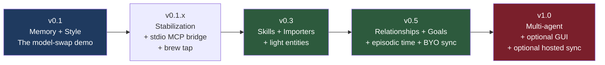
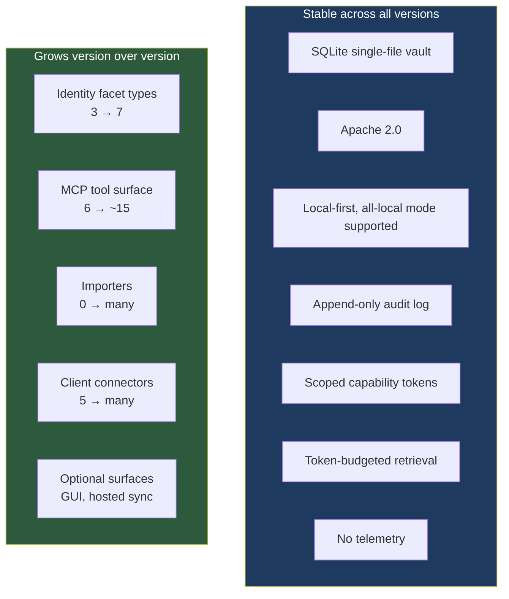

# Tessera — Release Specification

> _Agent identity that survives the substrate._

**Status:** Draft 1
**Date:** April 2026
**Owner:** Tom Mathews
**License:** Apache 2.0

---

## Versioning posture

Semantic versioning. Pre-1.0 means breaking changes between minor versions are acceptable; the schema migration path is explicit and reviewable. Post-1.0, breaking changes require a major version bump and documented migration.

Each version below specifies: scope, new identity facets, MCP surface additions, definition of done, and what's deferred.

The discipline: **a version ships only when its definition of done is fully green.** Partial v0.3 is not v0.3 — it stays v0.1.x until v0.3 actually meets its bar.

## Roadmap at a glance



Solid timeline aspirations, paced by solo-dev evening/weekend velocity:

| Version | Realistic ship target                        | Bar                                                              |
| ------- | -------------------------------------------- | ---------------------------------------------------------------- |
| v0.1    | 6–10 weeks from start                        | The model-swap demo works end-to-end on a single machine         |
| v0.1.x  | 4 weeks of stabilization                     | Real users (5+) successfully complete the demo without live help |
| v0.3    | 3 months after v0.1                          | Skills are usable, two importers ship                            |
| v0.5    | 6 months after v0.3                          | Multi-facet identity is coherent in real long-running agents     |
| v1.0    | When v0.5 has 100+ active vaults in the wild | Multi-agent works, optional GUI ships if anyone has asked        |

These are aspirations. The roadmap stretches if it stretches; the discipline is shipping a tight v0.1, not hitting a date.

---

## v0.1 — Memory + Style (the model-swap demo)

**The bar:** a fresh install on a clean machine, in under 10 minutes including Ollama setup, demonstrates the model-swap story. Capture in agent on model A → swap to model B → agent behaves continuously with prior voice and recent context.

### Scope

**Identity facets shipping**

- `episodic` — events, decisions, conversations
- `semantic` — facts the agent knows
- `style` — voice and writing samples (the load-bearing v0.1 addition)

**MCP tools shipping (six)**

- `capture(content, facet_type, source?, metadata?)`
- `recall(query, facet_types?, k=5)`
- `assume_identity(model_hint?, recent_window_hours=168)`
- `show(id, include_metadata=false)`
- `list_facets(facet_type?, limit=10, since?)`
- `stats()`

**CLI**

- `tessera init` — vault + daemon + default agent
- `tessera daemon [start|stop|status|logs]`
- `tessera agents [list|create|delete]`
- `tessera connect <client> [--agent X]` — generates token, writes MCP config
- `tessera disconnect <client>`
- `tessera tokens [list|create|revoke] [--agent X]`
- `tessera capture "..." [--facet-type X]` — manual capture
- `tessera recall "..." [--facet-types X,Y]`
- `tessera show <external_id>`
- `tessera stats`
- `tessera config [get|set] <key> [<value>]`
- `tessera models [list|set|test] <slot>` — embedder / extractor / reranker
- `tessera doctor` — health check
- `tessera vault [reembed|prune-old-models|vacuum]`
- `tessera export --format json|md|sqlite`

**Daemon**

- Single async Python process
- HTTP MCP on `127.0.0.1:5710`
- Unix socket for CLI control
- Auto-start via `launchd` (macOS) and systemd user unit (Linux)

**Storage**

- Single-file SQLite vault (`~/.tessera/vault.db`)
- `sqlite-vec` for vector search (per-model vec tables)
- FTS5 for BM25 keyword search
- Append-only audit log

**Model adapters** (see `tessera-model-adapters.md`)

- Three slots: embedder, extractor (optional), reranker
- Reference implementations: Ollama, OpenAI, sentence-transformers
- All-local mode (Ollama only) is a tested, supported configuration

**Retrieval pipeline**

- Hybrid candidate generation (vector + BM25)
- Reciprocal Rank Fusion merge
- Cross-encoder rerank (mandatory; warning to audit log if degraded)
- SWCR coherence reweighting — **opt-in at v0.1** (`retrieval_mode: swcr`). Default is `rerank_only` per `docs/adr/0009-swcr-opt-in-pending-ablation.md`; default-on flips at v0.1.x once B-RET-1 clears the spec thresholds on a harder dataset with human raters.
- MMR diversification
- Token-budgeted snippets

**Capability tokens**

- Per-agent, per-scope (`read`, `write`)
- Per-facet-type scoping (read style only, write episodic only, etc.)
- Token shown once at creation, stored as `sha256(token)` only
- Revocable, audit-logged

**Client connectors (write MCP config for)**

- Claude Desktop
- Claude Code
- Cursor
- Codex (`~/.codex/config.toml`)
- ChatGPT (Developer Mode — URL-embedded token)

### Definition of Done

Every item below has a corresponding benchmark or test artifact under `docs/benchmarks/` or `tests/`. A check mark without a reproducible artifact does not count.

**Install and demo path**

- [ ] Fresh install on clean macOS, Ubuntu, Windows. Init → connect Claude Code → capture session → swap to a different model → `assume_identity` returns coherent bundle → agent behaves continuously. **Measured path under 15 minutes** including Ollama install, embedder model pull (nomic-embed-text: ~1.4 GB), and reranker model download (~90 MB). Claim "under 10 minutes" is only made for the already-warm-cache path and must be reported with that qualifier.
- [ ] All-local mode (no cloud keys) passes the same demo end-to-end.
- [ ] `tessera doctor` correctly diagnoses: missing Ollama, bind-address conflict, broken `sqlite-vec`, missing model, vault schema mismatch, expired token, absent passphrase for encrypted vault, keyring access failure.

**Performance (reference hardware: M1 Pro, 16 GB)**

- [ ] `recall` latency: **B-RET-2** results meet p50 < 500 ms, p95 < 1 s, p99 < 2 s at 10K facets; p50 < 1 s, p95 < 2.5 s at 100K facets.
- [ ] `assume_identity` latency: **B-RET-3** results meet p50 < 1.5 s, p95 < 3 s at 10K facets returning a 6K-token bundle.
- [ ] Concurrent-capture throughput: **B-WRITE-1** results meet sustained ≥ 50 writes/sec at p99 < 200 ms with 10 concurrent MCP clients.
- [ ] Async embed throughput: **B-EMB-1** shows no facet lingers in `pending` > 10 minutes under nominal capture rate; recovery from Ollama restart completes queued embeds within 60 s.
- [ ] Re-embed wall time: **B-REEMBED-1** shows a 10K-facet re-embed completes in < 10 minutes on M1 Pro; during re-embed, shadow-query preserves recall coherence (nDCG@k regression < 20%).
- [ ] Encryption overhead: **B-SEC-1** shows sqlcipher tax on `recall` p95 ≤ 15% vs. unencrypted baseline; daemon cold unlock < 500 ms.

**Correctness**

- [ ] Test coverage ≥ 80% overall, ≥ 90% on `vault/`, `retrieval/`, `adapters/`, `auth/`, `migration/`.
- [ ] Token budget never exceeded in any test case across the full suite; tested with `tiktoken cl100k_base`.
- [ ] Determinism test: 100 sequential `recall` calls with identical query and vault state return bit-identical result IDs.
- [ ] Migration test: every `v0.1.x` → `v0.1.(x+1)` migration passes the DoD defined in `docs/migration-contract.md` (forward, interrupted-resume, rollback round-trip).

**Retrieval quality (see `docs/swcr-spec.md §Ablation protocol`)**

SWCR ships as an opt-in retrieval mode at v0.1. The spec's default-on gates did not clear on the first-pass ablation (see `docs/benchmarks/B-RET-1-swcr-ablation/` and `docs/adr/0009-swcr-opt-in-pending-ablation.md`). The v0.1 DoD items below are the minimal bar for opt-in shipping; the full default-on gate graduates at v0.1.x once a harder dataset + human-rater run clears the spec thresholds.

- [x] **B-RET-1** ablation recorded: RRF-only, RRF+rerank, RRF+rerank+SWCR compared on synthetic vault S1 with fake and real adapters.
- [x] Pure-relevance MRR@k: SWCR does not regress catastrophically vs. RRF+rerank. (Fake-adapter run: −2.0 % MRR in noise-dominated regime. Real-adapter run: no regression; both arms saturate.)
- [x] SWCR is exposed as `retrieval_mode: swcr` with `rerank_only` as the shipping default.
- [ ] Coherence-human (deferred to v0.1.x): 3 blind raters × 50 `assume_identity` bundles × 5-point scale. Mean ≥ 4.0 on SWCR pipeline, and at least +0.3 absolute over RRF+rerank baseline. **Graduation gate for default-on.**
- [ ] Bundle nDCG@k (deferred to v0.1.x): SWCR improves over RRF+rerank by ≥ 10 % on a harder S1' dataset with cross-persona entity overlap. **Graduation gate for default-on.**
- [ ] Style-facet diversity: top-K voice samples in `assume_identity` bundles are pairwise cosine distance ≥ 0.3 (no near-duplicates). Measured at P6 when identity bundle lands.

**Security and privacy**

- [ ] Encryption at rest is the default and is tested: `tessera init` without passphrase prompt is a test failure; exported vault is unreadable without passphrase.
- [ ] Capability tokens have mandatory expiry; no code path issues an indefinite-lifetime token.
- [ ] Refresh-token rotation is tested: old refresh token invalid after one use.
- [ ] Revocation reflects within 30 s in all test paths.
- [ ] Unix socket is the control-plane default on macOS and Linux; HTTP MCP binds to loopback and rejects non-MCP `Origin` headers.
- [ ] Hard-delete cascade: `tessera vault purge` removes row, FTS entry, vec rows across all registered models, and hashes the corresponding audit entries.
- [ ] **B-SEC-2** no-outbound test: full suite passes with all outbound blocked except configured adapters.
- [ ] Secret-scanner grep: no hardcoded credentials in source; keyring integration tested.

**User validation**

- [ ] One real user (not Tom) successfully completes the model-swap demo with no live help, in a recorded session, within the measured install time budget.
- [ ] Diagnostic bundle (`tessera doctor --collect`) produces a tarball that passes the scrubber on both a synthetic vault and a real vault; the produced tarball contains no content or secrets.

### Deferred to v0.3 or later

| Deferred                                                       | Why not v0.1                                                           |
| -------------------------------------------------------------- | ---------------------------------------------------------------------- |
| Skills as first-class facet                                    | Format design needs a real user to inform; defer until usage signal    |
| Importers (ChatGPT export, Claude project export, Obsidian, X) | Each is a small project; v0.1 ships before any importer                |
| Light entity resolution (people, projects)                     | v0.1 captures entities in metadata JSON; structured resolution is v0.3 |
| Episodic temporal queries                                      | Episodic exists; "show me what happened last Tuesday" is v0.5          |
| BYO cloud sync                                                 | Architecturally simple but adds surface area; v0.5                     |
| Web/desktop UI                                                 | Violates "the product disappears"; v1.0 if ever                        |
| Multi-agent shared facet namespaces                            | Permission complexity; v0.5                                            |
| Hosted sync service                                            | Solo-dev v0.1 cannot run user-facing infrastructure                    |
| Auto-capture (clipboard, screen, keylog)                       | **Never.** Ideology bar                                                |

---

## v0.1.x — Stabilization

The releases between v0.1 and v0.3 are stabilization, not feature work. The bar to graduate to v0.3 is real-user signal.

### Scope

- Stdio MCP bridge for clients that don't speak HTTP MCP cleanly
- Homebrew tap (`brew install tessera`)
- `.deb` and `.rpm` releases for Linux
- Bug fixes from real-user reports
- Performance work surfaced by real vaults
- Documentation expansion (real-world examples, troubleshooting)

### Definition of Done

- [ ] At least 5 real users (not Tom, not direct collaborators) have successfully run the demo and shared feedback
- [ ] At least 1 user reports running Tessera continuously for 4+ weeks
- [ ] No P0 bugs open in the issue tracker
- [ ] Setup time for a non-developer technical user < 15 minutes from `pip install` to working demo
- [ ] At least 3 different agent harnesses verified working (Claude Code, Cursor, ChatGPT Dev Mode minimum)

---

## v0.3 — Skills + Importers + Light Entities

**The bar:** an agent's identity now includes learned procedures, real prior conversations are importable, and people/projects mentioned in episodics are resolved as light entities.

### Scope

**New identity facets**

- `skill` — learned procedures stored as `.md` files in vault, syncable to disk
- `entity` (light) — resolved people, projects, named concepts; foreign-key from facets

**New MCP tools**

- `learn_skill(name, description, procedure_md)` — write a skill
- `get_skill(name_or_query)` — fetch skill content
- `list_skills([active_only=true])`
- `resolve_entity(mention, type_hint?)` — entity resolution helper

**New CLI**

- `tessera skills [list|show|edit|sync-to-disk|sync-from-disk]`
- `tessera entities [list|merge|split]`
- `tessera import <source> <path>`

**Importers (at least two ship in v0.3)**

- ChatGPT export (`conversations.json` from data export)
- Claude export
- Stretch: Obsidian vault, X/Twitter export, email mbox

**Schema additions**

```sql
-- Light entity table
CREATE TABLE entities (
  id            INTEGER PRIMARY KEY,
  external_id   TEXT NOT NULL UNIQUE,
  agent_id      INTEGER NOT NULL REFERENCES agents(id),
  entity_type   TEXT NOT NULL,        -- 'person', 'project', 'place', 'concept'
  canonical_name TEXT NOT NULL,
  aliases       TEXT NOT NULL DEFAULT '[]',  -- JSON array
  metadata      TEXT NOT NULL DEFAULT '{}',
  created_at    INTEGER NOT NULL,
  UNIQUE(agent_id, entity_type, canonical_name)
);

-- Mention table linking facets to entities
CREATE TABLE entity_mentions (
  id          INTEGER PRIMARY KEY,
  facet_id    INTEGER NOT NULL REFERENCES facets(id),
  entity_id   INTEGER NOT NULL REFERENCES entities(id),
  confidence  REAL NOT NULL DEFAULT 1.0,
  UNIQUE(facet_id, entity_id)
);

-- Skills are facets with facet_type='skill', plus optional disk sync metadata
ALTER TABLE facets ADD COLUMN disk_path TEXT;
```

### Definition of Done

- [ ] Skill round-trip: agent learns a skill via `learn_skill`, retrieves via `get_skill`, applies it in a fresh session
- [ ] Skill disk sync: `tessera skills sync-to-disk` writes `.md` files; edits to those files sync back via `sync-from-disk`
- [ ] At least one ChatGPT export (5K+ conversations) imports successfully and is queryable
- [ ] At least one Claude export imports successfully
- [ ] Entity resolution: re-uses the same entity when "Sarah," "Sarah J," and "Sarah Johnson" appear across facets, with explicit user confirmation for fuzzy matches
- [ ] `assume_identity` includes top-K active skills in the returned bundle
- [ ] Skills are namespace-isolated per agent (one agent's skill doesn't leak to another in the same vault)

---

## v0.5 — Relationships + Goals + Episodic Time + BYO Sync

**The bar:** Tessera handles the full identity surface needed for long-running autonomous agents — relationships with persistent history, declared goals, time-aware episodic queries, and optional cloud sync to BYO storage.

### Scope

**New identity facets**

- `relationship` — persistent, evolving model of who an agent works with
- `goal` — declared agent goals and values, weighted, time-bounded

**Episodic temporal upgrades**

- Time-aware retrieval ("what happened the week of X")
- Episode segmentation (related episodics grouped into sessions)
- Decay-weighted scoring for time-sensitive recall

**BYO cloud sync**

- S3-compatible target (S3, B2, Tigris, Cloudflare R2, MinIO)
- End-to-end encrypted at rest in cloud (key stays local)
- **Conflict resolution: append-on-conflict for facets, manual merge for entities.** Facets are deduplicated by `content_hash` only; simultaneous captures with different content on different machines both survive the sync. Last-writer-wins is explicitly rejected for facets because it silently drops learnings, which is category-inconsistent with an identity layer.
- Manual merge applies only to entities (where name collisions produce semantically meaningful conflicts). `tessera entities merge` is the user-facing resolution.
- Per-device `captured_on_device` metadata is attached to every facet at capture time to disambiguate near-duplicate captures during review.

**New MCP tools**

- `recall_episode(time_range, query?)` — time-aware episodic queries
- `get_relationship(entity_id_or_name)` — full relationship history
- `get_goals([active_only=true])` — current goals
- `update_goal(goal_id, status, notes)` — goal progression

**New CLI**

- `tessera sync [setup|status|push|pull|conflicts]`
- `tessera relationships [list|show|merge]`
- `tessera goals [list|create|update|complete]`
- `tessera episodes [list|show <id>]`

### Definition of Done

- [ ] An agent runs for 30+ days with all v0.5 facets populated; identity bundle remains coherent at month-end
- [ ] Time-aware queries return correct results across timezones (test with explicit timezone metadata)
- [ ] BYO sync round-trip: vault → S3-compatible bucket → restore on second machine → identical state
- [ ] Sync handles 50K+ facets without blocking the daemon
- [ ] Encryption: data at rest in cloud is unreadable without local key (verified by attempting to read with key absent)
- [ ] `assume_identity` includes goals, key relationships, and recent episodes in budget
- [ ] At least 1 user reports running multi-machine sync continuously

---

## v1.0 — Multi-agent + Optional GUI + Optional Hosted Sync

**The bar:** Tessera is production-ready for users running multiple agents in one vault with shared and isolated facets. An optional GUI exists for users who want it (the CLI remains primary). Optional hosted sync exists for users who don't want to run their own S3.

### Scope

**Multi-agent identity**

- `judgment` facet — captured trade-off patterns, weighted decisions
- Shared facet namespaces — multiple agents can read shared semantic facts while keeping episodic isolated
- Permission model: per-agent, per-namespace, per-facet-type
- Agent forking — derive a new agent from an existing one's identity

**Optional desktop GUI**

- Built with Tauri (Rust + web frontend) — single binary
- Browse facets, manage capability tokens, view audit log
- Visualize identity bundle for `assume_identity` calls
- Edit skills inline
- Optional. CLI remains primary.

**Optional hosted sync service**

- $5–10/mo, BYO storage always free
- End-to-end encrypted; service holds ciphertext only
- Multi-device sync without user-managed S3
- Compliance-grade audit log access

**Schema additions**

```sql
-- Shared facet namespaces
CREATE TABLE namespaces (
  id            INTEGER PRIMARY KEY,
  external_id   TEXT NOT NULL UNIQUE,
  name          TEXT NOT NULL,
  description   TEXT,
  created_at    INTEGER NOT NULL
);

CREATE TABLE namespace_members (
  namespace_id  INTEGER NOT NULL REFERENCES namespaces(id),
  agent_id      INTEGER NOT NULL REFERENCES agents(id),
  scopes        TEXT NOT NULL,  -- JSON: per-facet-type read/write
  PRIMARY KEY (namespace_id, agent_id)
);

ALTER TABLE facets ADD COLUMN namespace_id INTEGER REFERENCES namespaces(id);
```

### Definition of Done

- [ ] 100+ active vaults in the wild (telemetry-free; measured by GitHub clone count + voluntary user reports)
- [ ] Multi-agent demo: two agents in one vault share semantic facts, isolate episodics, both pass `assume_identity` coherence checks
- [ ] GUI: feature-parity with CLI for all read operations, browse and search work; write operations through CLI for safety
- [ ] Hosted sync (if shipped): zero data loss in 30 days of dogfooding by Tom + at least 3 external users
- [ ] Documentation: complete API reference, contributor guide, real-world example walkthroughs for at least 5 use cases
- [ ] At least one third-party adapter contributed (new embedder, new connector, new importer)

---

## Anti-roadmap

The following will **never** ship in Tessera, regardless of demand. These are ideology bars, not engineering deferrals:

| Will not ship                                                                    | Reason                                                                                                    |
| -------------------------------------------------------------------------------- | --------------------------------------------------------------------------------------------------------- |
| Auto-capture (clipboard monitoring, screen recording, keylogging)                | The agent or user decides what to capture. Surveillance is anti-ideology.                                 |
| Hosted-only mode (no local option)                                               | Local-first is the foundation. Hosted is opt-in convenience.                                              |
| Model reselling (premium tiers with bundled GPT-X access)                        | Tessera is the layer, not a model vendor. The moment we resell models, we conflict with our own ideology. |
| Proprietary embedding scheme                                                     | Lock-in destroys the ownership claim.                                                                     |
| Closed-source server with open-source client                                     | The whole stack is Apache 2.0. No "open core" sleight of hand.                                            |
| Telemetry / usage analytics in the open-source build                             | Verifiable by source review. CI grep check enforces.                                                      |
| Plugin marketplace with revenue share                                            | Maybe in 5 years if there are users to justify it. Not a v1.0 problem. Not a v3.0 problem.                |
| AI-generated capture (the daemon decides what to remember on the agent's behalf) | The agent decides. The daemon stores. Separation of concerns.                                             |
| Vendor-specific integrations (e.g., "The Official Anthropic Memory Layer")       | Tessera dies the day it becomes a vendor's official anything.                                             |

---

## Cross-version invariants

These hold from v0.1 through v1.0 and beyond. Breaking any of them requires a major version bump and a public RFC.

1. **Vault is a single SQLite file.** The user can copy it. Inspect it. Email it. Email it to themselves. The vault is the agent.
2. **All-local mode is a tested, supported configuration.** Every release passes the demo with zero cloud dependencies.
3. **Audit log is append-only and complete.** Every mutation is logged. No silent operations.
4. **Capability tokens are scoped, not bearer.** No shared "MCP_ACCESS_KEY" pattern. Per-agent, per-scope, per-facet-type.
5. **Token budgets are enforced at every retrieval surface.** No tool call returns more than its declared budget.
6. **Identity facet types are stable.** The seven facets (episodic, semantic, style, skill, relationship, goal, judgment) are the contract. New facet types require RFC.
7. **No telemetry.** Verified by CI.
8. **Apache 2.0.** No license changes for any version.

---

## What changes between versions vs. what doesn't



The constraint that's hardest to hold and most important: **the stable invariants are non-negotiable.** Every feature addition is checked against them. If a feature requires breaking an invariant (e.g., "we need to disable the audit log for this perf optimization"), the feature loses.

---

## Reading next

- **System Overview** — strategic context, market, moat
- **System Design** — architecture, schema, retrieval pipeline
- **Pitch** — share-with-colleagues version
- **Model Adapters** — the three-slot adapter framework
