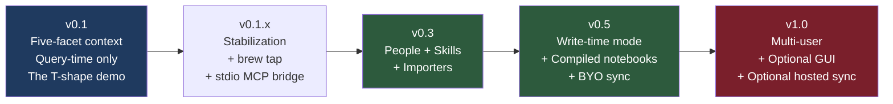
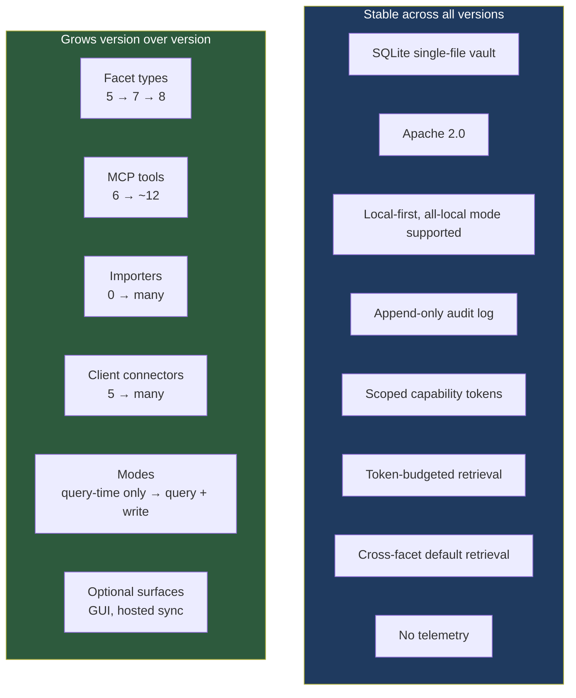

# Tessera — Release Specification

> *A portable context layer for AI tools, paced by solo-dev velocity and real-user signal.*

**Status:** Draft (post-reframe)
**Date:** April 2026
**Owner:** Tom Mathews
**License:** Apache 2.0

---

## Versioning posture

Semantic versioning. Pre-1.0 means breaking changes between minor versions are acceptable; the migration path is explicit and reviewable. Post-1.0, breaking changes require a major version bump and a documented migration.

A version ships only when its Definition of Done is fully green. Partial v0.3 is not v0.3 — it stays v0.1.x until v0.3 actually meets its bar.

## Roadmap at a glance



Timeline estimates, paced by solo-dev evening and weekend velocity:

| Version | Estimated ship window | Bar |
|---|---|---|
| v0.1 | 6–10 weeks from start | The T-shape cross-facet synthesis demo works end-to-end |
| v0.1.x | 4 weeks of stabilization | 5+ real users (not Tom) successfully complete the demo without live help |
| v0.3 | 3 months after v0.1 | People + Skills facets in real use; two importers shipped |
| v0.5 | 6 months after v0.3 | Write-time compilation is useful for a real vertical-depth topic |
| v1.0 | When v0.5 has 100+ active vaults in the wild | Multi-user works; optional GUI if demanded |

The windows above are estimates, not commitments. A version ships when its Definition of Done is green, not when the calendar says so. The discipline is shipping a tight v0.1 that nails the T-shape demo, not hitting a date. Definition-of-Done items in each release section below are hard gates: every checkbox must be green before the version ships.

---

## v0.1 — Five-facet context, query-time only, the T-shape demo

**The bar.** A fresh install on a clean machine, under 10 minutes including Ollama setup, demonstrates the T-shape cross-facet synthesis story. Tom teaches Claude his LinkedIn writing rules and anneal project context. Tom opens ChatGPT. ChatGPT drafts a LinkedIn post that feels like Tom wrote it — voice, workflow, project details, no-emoji preference — all without configuring ChatGPT separately.

### Scope

**Five facets shipping**
- `identity` — stable-for-years user facts
- `preference` — stable-for-months behavioral rules
- `workflow` — procedural patterns
- `project` — active work context
- `style` — writing voice samples

All five are query-time only. The `mode` field in the schema is populated (`query_time`) but never exposed to users.

**Six MCP tools shipping**
- `capture(content, facet_type, source_tool?, metadata?)`
- `recall(query_text, facet_types? = all readable facets, k=10, requested_budget_tokens?)` — **cross-facet by default**
- `show(external_id)`
- `list_facets(facet_type, limit=20, since?)`
- `stats()`
- `forget(external_id, reason?)`

**CLI**
- `tessera init` — vault + daemon + default user
- `tessera daemon [start|stop|status|logs]`
- `tessera connect <tool>` — generates token, writes MCP config
- `tessera disconnect <tool>`
- `tessera tokens [list|create|revoke]`
- `tessera capture "..." [--facet-type X]`
- `tessera recall "..." [--facet-types X,Y]`
- `tessera show <external_id>`
- `tessera forget <external_id>`
- `tessera stats`
- `tessera config [get|set] <key> [<value>]`
- `tessera models [list|set|test] <slot>`
- `tessera doctor` — end-to-end health check
- `tessera vault [reembed|prune-old-models|vacuum]`
- `tessera export --format json|md|sqlite [--out PATH]`

**Daemon**
- Single async Python process
- HTTP MCP server on `127.0.0.1:5710`
- Unix socket for CLI control
- Auto-start via `launchd` (macOS) + systemd user unit (Linux)

**Storage**
- Single-file SQLite vault (`~/.tessera/vault.db`)
- `sqlite-vec` for vectors (per-model vec tables)
- FTS5 for BM25
- Append-only audit log
- Schema includes `mode` column + empty `compiled_artifacts` table (v0.5 hooks)

**Model adapters** (unchanged from pre-reframe)
- Three slots: embedder, extractor (optional), reranker
- Reference: Ollama, OpenAI, sentence-transformers
- All-local mode (Ollama only) is tested and supported

**Retrieval pipeline**
- Hybrid candidate generation (vector + BM25) per facet type in scope
- Reciprocal Rank Fusion merge per facet type
- **SWCR topology weighting for cross-facet coherence** — the load-bearing differentiator
- Cross-encoder rerank (mandatory; fallback warns to audit, never silent)
- MMR diversification per facet
- Token budget distributed proportionally across facets in scope

**Capability tokens**
- Per-tool, per-scope, per-facet-type
- Token shown once; stored as `sha256(token)` only
- Revocable, audit-logged

**Client connectors**
- Claude Desktop
- Claude Code
- Cursor
- Codex (`~/.codex/config.toml`)
- ChatGPT Developer Mode is deferred to v0.1.x until HTTPS, auth-mode, and canonical HTTP MCP compatibility are implemented.

### Definition of Done for v0.1

v0.1 is a **developer preview**. It is not a general release until clean-VM install and external-user demo gates pass.

Per-item evidence tracked in `docs/v0.1-dod-audit.md` (last audit: 2026-04-24 at commit `32b7395`). Checkboxes below reflect audit state at that commit.

- [ ] Fresh install on clean macOS, Ubuntu, Windows: init → Ollama setup → connect Claude Desktop or Claude Code → capture preference/workflow/project/style → `recall` returns coherent cross-facet bundle → fresh client session drafts in Tom's voice using right structure. **Under 10 minutes end-to-end.** *(Pending: cross-platform smoke, P14 task 4. ChatGPT Developer Mode is v0.1.x.)*
- [x] All-local mode (no cloud keys) passes the same demo. *(Code path is all-local by default; cross-platform recording tracked under the previous item.)*
- [x] `tessera doctor` correctly diagnoses: missing Ollama, port 5710 conflict, broken `sqlite-vec`, missing model, vault schema mismatch, expired token, empty facet types. *(All seven checks in `src/tessera/daemon/doctor.py`, tests in `tests/integration/test_daemon_doctor_vault.py` + `tests/unit/test_daemon_doctor.py`.)*
- [x] Test coverage ≥ 80% on `vault/`, `retrieval/`, `adapters/`, `auth/`, `daemon/`. *(Critical-dir roll-up 91.58% at audit commit.)*
- [ ] MCP `recall` latency tiers under real adapters (Ollama `nomic-embed-text` + sentence-transformers `cross-encoder/ms-marco-MiniLM-L-6-v2`, `rerank_candidate_limit=20`, 100 trials after a discarded warm-up call), on the reference hardware baseline: **MacBook Pro M1 Pro (10-core CPU, 16-core GPU), 16 GB RAM, macOS 15.x, daemon idle except for the test query, no concurrent Ollama workload, Ollama model pinned via `keep_alive=-1`**.

  | Tier | Vault size | p50 | p95 | p99 | Evidence |
  |------|-----------:|----:|----:|----:|----------|
  | Demo-day | ≤ 500 facets | < 500 ms | < 1000 ms | < 1500 ms | `docs/benchmarks/B-RET-2-recall-latency/results/20260423T215936Z.json` (404 / 574 / 674 ms) |
  | Steady-state | 10K facets | < 800 ms | < 1000 ms | < 1500 ms | `docs/benchmarks/B-RET-2-recall-latency/results/20260423T182517Z.json` (CPU tier, 730/778/897 ms) |
  | Steady-state (opt-in accelerator) | 10K facets | < 800 ms | < 1000 ms | < 1500 ms | `docs/benchmarks/B-RET-2-recall-latency/results/20260423T212745Z.json` (MPS tier, 710/832 ms; p99 dominated by one Ollama stall) |

  Rationale for the revised envelope: the 500 ms p50 @ 10K ceiling set pre-measurement did not account for the pipeline's structural floor — Ollama query-embed HTTP round-trip (~40–80 ms), dense vec linear scan (~80–150 ms at 10K × 768-dim on sqlite-vec), SWCR reweight + MMR + audit (~60–100 ms), cross-encoder rerank at k=20 (~80–100 ms) — none of which are reducible without an architectural change deferred to v0.1.x (parallel per-facet-type query fanout, ANN index, in-process embedder). The demo-day tier keeps the original 500 ms promise for the first-user experience the T-shape demo runs against; the steady-state tier is the year-two scaling promise.
- [x] SWCR coherence check: cross-facet `recall` returns at least one facet from each type in scope (when candidates exist) — proven by integration test with realistic vault. *(`tests/integration/test_retrieval_pipeline.py` + B-RET-1 quality evidence at `docs/benchmarks/B-RET-1-swcr-ablation/results/20260423T220323Z.json`.)*
- [x] Token budget never exceeded in any test case. *(`tests/unit/test_retrieval_budget.py`, `tests/integration/test_mcp_tool_surface.py::test_recall_clamps_over_budget_request`.)*
- [x] Zero outbound network calls except those triggered by user/tool intent. Verified by source review and CI grep check. *(CI `no-outbound` job + `scripts/no_telemetry_grep.sh`.)*
- [ ] One real user (not Tom) successfully completes the T-shape demo with no live help, recorded. *(Pending-external; P14 task 6. Hard release blocker.)*
- [ ] Documentation: README, pitch, system-overview, system-design, release-spec, SWCR spec, threat model, migration contract, non-goals, observability/determinism spec, 10+ ADRs. *(Every listed doc present; README post-reframe rewrite tracked under P15 task 4.)*

### What v0.1 explicitly does NOT ship

| Excluded from v0.1 | Reason | Target |
|---|---|---|
| People facet | Needs usage to shape | v0.3 |
| Skills facet | Needs usage to shape | v0.3 |
| Write-time mode / compiled notebooks | Vertical-depth work; needs v0.1 users to shape the compiler | v0.5 |
| Importers (ChatGPT, Claude, Obsidian, Gmail) | Each is a small project | v0.3 |
| Episodic temporal queries | Not needed for the horizontal touch | v0.5 if ever |
| BYO cloud sync | Architecturally simple but adds surface | v0.5 |
| Web/desktop UI | Violates "the product disappears" | v1.0 if ever |
| Multi-user vaults / shared namespaces | Permission complexity | post-1.0 |
| Hosted sync service | Solo-dev cannot run user-facing infra | v1.0 if ever |
| Auto-capture (clipboard, screen, keylog) | **Never.** Ideology bar. | never |

---

## v0.1.x — Stabilization

The releases between v0.1 and v0.3 are stabilization, not feature work. The bar to graduate to v0.3 is real-user signal.

### Scope

- Stdio MCP bridge for clients that don't speak HTTP MCP cleanly
- Homebrew tap (`brew install tessera`)
- `.deb` and `.rpm` releases for Linux
- Bug fixes from real-user reports
- Performance work surfaced by real vaults
- Documentation expansion (real-world examples, troubleshooting)
- At least one additional client connector written from a user request

### Definition of Done for v0.1.x

- [ ] 5+ real users (not Tom, not direct collaborators) have successfully run the T-shape demo and shared feedback
- [ ] 1+ user reports running Tessera continuously for 4+ weeks
- [ ] No P0 bugs open in the issue tracker
- [ ] Setup time for a non-developer technical user < 15 minutes from `pip install` to working demo
- [ ] 3+ different AI tools verified working (Claude Code, Cursor, ChatGPT Dev Mode minimum)
- [ ] Tom has dogfooded Tessera for at least 60 days without regression

---

## v0.3 — People + Skills + Importers

**The bar.** The user's context layer expands to cover relationships and learned procedures. Existing AI conversation history (from ChatGPT and Claude exports) becomes importable and queryable. People and skills facets prove their design against real usage.

### Scope

**New facets**
- `person` — persistent model of individuals the user works with (colleagues, peers, mentors, public figures referenced regularly). Fields: canonical name, aliases, relationship context, interaction style, notes.
- `skill` — learned procedures stored as `.md` content, syncable to disk. Fields: name, description, procedure markdown, disk path if synced.

**New MCP tools**
- `learn_skill(name, description, procedure_md)`
- `get_skill(name_or_query)`
- `resolve_person(mention, disambiguation?)`
- `list_skills([active_only=true])`
- `list_people([filter])`

**New CLI**
- `tessera skills [list|show|edit|sync-to-disk|sync-from-disk]`
- `tessera people [list|show|merge|split]`
- `tessera import <source> <path>`

**Importers (at least two ship in v0.3)**
- ChatGPT export (`conversations.json` from data export)
- Claude export
- Stretch: Obsidian vault, email mbox, Notion export

Importers backfill the **v0.1 facet types** — `identity | preference | workflow | project | style` — from exported conversation history. They do not write to `skill`: skills are authored by the user via the `learn_skill` MCP tool, not derived from past conversations. Person mentions surfaced during import populate the `people` and `person_mentions` tables via the same resolution flow as interactive capture.

**Schema additions**
```sql
-- Person-specific table to support relationship queries
CREATE TABLE people (
  id            INTEGER PRIMARY KEY,
  external_id   TEXT NOT NULL UNIQUE,
  user_id       INTEGER NOT NULL REFERENCES users(id),
  canonical_name TEXT NOT NULL,
  aliases       TEXT NOT NULL DEFAULT '[]',          -- JSON array
  metadata      TEXT NOT NULL DEFAULT '{}',
  created_at    INTEGER NOT NULL,
  UNIQUE(user_id, canonical_name)
);

-- Link facets that mention people
CREATE TABLE person_mentions (
  id          INTEGER PRIMARY KEY,
  facet_id    INTEGER NOT NULL REFERENCES facets(id),
  person_id   INTEGER NOT NULL REFERENCES people(id),
  confidence  REAL NOT NULL DEFAULT 1.0,
  UNIQUE(facet_id, person_id)
);

-- Skills have an optional disk path for sync
ALTER TABLE facets ADD COLUMN disk_path TEXT;  -- populated when facet_type='skill'
```

### Definition of Done for v0.3

- [ ] Skill round-trip: user learns skill via `learn_skill` in Claude → retrieves via `get_skill` in Cursor → applies in fresh session
- [ ] Skill disk sync: `tessera skills sync-to-disk` writes `.md` files; edits sync back via `sync-from-disk`
- [ ] At least one ChatGPT export (5K+ conversations) imports successfully and is queryable via `recall`
- [ ] At least one Claude export imports successfully
- [ ] Person resolution: handles "Sarah," "Sarah J," "Sarah Johnson" as same entity with explicit confirmation for fuzzy matches
- [ ] `recall` includes top-K people and skills in cross-facet bundles when relevant
- [ ] Tom has dogfooded Tessera with real ChatGPT/Claude import for 30+ days

---

## v0.5 — Write-time mode + Compiled notebooks + BYO sync

**The bar.** Tessera becomes useful for the vertical depth of the T-shape — long-running research topics, evolving deep domain thinking. Write-time compilation produces Karpathy-style synthesized artifacts. BYO cloud sync makes multi-machine use practical.

### Scope

**New facet activated**
- `compiled_notebook` — write-time compiled artifact. Sources: user-tagged `project` and `skill` facets. Output: synthesized markdown artifact in `compiled_artifacts` table.

**Write-time compilation**
- Compilation agent reads source facets, synthesizes narrative artifact
- Scheduled or on-demand
- Source mutations mark artifact stale; next run rebuilds
- User opts in per-project: `tessera projects compile <name> --schedule daily`

**Episodic temporal upgrades** (if user signal warrants)
- Time-aware retrieval for projects ("what was I thinking about anneal two weeks ago")
- Episode segmentation for related captures

**BYO cloud sync**
- S3-compatible target (S3, B2, Tigris, Cloudflare R2, MinIO)
- End-to-end encrypted at rest in cloud (key stays local)
- Conflict resolution: last-writer-wins on facets; manual merge for people

**New MCP tools**
- `recall_notebook(topic)` — read compiled artifact
- `compile(project_external_id)` — manual trigger
- `recall_temporal(time_range, query?)` — if shipped

**New CLI**
- `tessera sync [setup|status|push|pull|conflicts]`
- `tessera compile [list|run|schedule|stale]`
- `tessera notebooks [list|show|export]`

**v0.5 ships write-time as a new facet type, not as a per-facet mode toggle.** Users tag a `project` or `skill` as vertical-depth; the compilation agent produces a new `compiled_notebook` facet with `mode=write_time` from those source facets. The source facets stay `mode=query_time`. There is no user-facing switch that converts an existing `preference`, `workflow`, `project`, or `style` row from `query_time` to `write_time` — the `mode` column records the row's production method, not a user choice. A per-facet user-visible mode toggle on existing facet types is not a v0.5 commitment; if real-user signal calls for one after v0.5, it becomes a later decision.

### Definition of Done for v0.5

- [ ] Tom's dissertation research topic ships as a `compiled_notebook` and produces genuinely useful synthesized output
- [ ] Compilation is idempotent and resumable; can interrupt mid-run without corruption
- [ ] Stale detection correctly identifies when source facets have changed
- [ ] BYO sync round-trip: vault → S3-compatible bucket → restore on second machine → identical state
- [ ] Sync handles 50K+ facets without blocking the daemon
- [ ] Encryption: data at rest in cloud is unreadable without local key (verified by attempting read with key absent)
- [ ] `recall` transparently surfaces compiled artifacts when relevant, marks stale ones in response metadata
- [ ] 1+ user reports running multi-machine sync continuously for 30+ days
- [ ] Tom has dogfooded write-time compilation for his actual research for 60+ days

---

## v1.0 — Multi-user + Optional GUI + Optional hosted sync

**The bar.** Tessera is production-ready. Multiple users can share a vault with proper permission boundaries. An optional GUI exists for users who want it (CLI remains primary). Optional hosted sync exists for users who don't want to run their own S3.

### Scope

**Multi-user**
- Multiple users in one vault (household, team, mentoring pair)
- Per-user-per-facet-type scopes
- Shared namespaces for facts both users want (e.g., household preferences)
- Audit log attributes per-user activity

**Optional desktop GUI**
- Built with Tauri (Rust + web frontend) — single binary
- Browse facets, manage tokens, view audit log
- Visualize cross-facet `recall` bundles
- Edit skills inline
- Optional. CLI remains primary.

**Optional hosted sync service**
- $5–10/mo, BYO storage always free
- End-to-end encrypted; service holds ciphertext only
- Multi-device sync without user-managed S3

**Schema additions**
```sql
-- Namespaces for shared facet visibility
CREATE TABLE namespaces (
  id            INTEGER PRIMARY KEY,
  external_id   TEXT NOT NULL UNIQUE,
  name          TEXT NOT NULL,
  description   TEXT,
  created_at    INTEGER NOT NULL
);

CREATE TABLE namespace_members (
  namespace_id  INTEGER NOT NULL REFERENCES namespaces(id),
  user_id       INTEGER NOT NULL REFERENCES users(id),
  scopes        TEXT NOT NULL,
  PRIMARY KEY (namespace_id, user_id)
);

ALTER TABLE facets ADD COLUMN namespace_id INTEGER REFERENCES namespaces(id);
```

### Definition of Done for v1.0

- [ ] 100+ active vaults in the wild (measured by GitHub clones + voluntary user reports)
- [ ] Multi-user demo: two users in one vault share preferences, isolate projects, both pass cross-facet `recall` coherence
- [ ] GUI (if shipped): feature-parity with CLI for read operations
- [ ] Hosted sync (if shipped): zero data loss in 30 days of dogfooding by Tom + 3+ external users
- [ ] At least one third-party adapter contributed (new embedder, connector, or importer)
- [ ] Documentation: complete API reference, contributor guide, 5+ real-world example walkthroughs
- [ ] Security audit completed by an external party

---

## Anti-roadmap — what Tessera will never ship

Ideology bars, not engineering deferrals. Regardless of demand, these are permanent exclusions.

| Will not ship | Reason |
|---|---|
| Auto-capture (clipboard monitoring, screen recording, keylogging) | The user or the AI tool decides what to capture. Surveillance is anti-ideology. |
| Hosted-only mode (no local option) | Local-first is the foundation. Hosted is opt-in convenience. |
| Model reselling (premium tiers with bundled GPT-X) | Tessera is the layer, not a model vendor. |
| Proprietary embedding scheme | Lock-in destroys the ownership claim. |
| Closed-source server with open-source client | The whole stack is Apache 2.0. No "open core" sleight of hand. |
| Telemetry or usage analytics in the open-source build | Verified by source review. CI grep check enforces. |
| Plugin marketplace with revenue share | Maybe in 5 years if there's reason. Not a v1.0 problem. Not a v3.0 problem. |
| AI-generated capture (daemon deciding what to remember) | The user or tool decides. The daemon stores. Separation of concerns. |
| Vendor-specific integrations ("Official Anthropic Context Layer") | Tessera dies the day it becomes a vendor's official anything. |
| Cloud-PaaS default dependency (Supabase, managed Postgres, hosted vector DB) | Single-file SQLite is the foundation. Any cloud-PaaS default forecloses offline use, single-file export, region-independence, and zero-account install — which are the foundations, not features. |

---

## Cross-version invariants

These hold from v0.1 through v1.0 and beyond. Breaking any of them requires a major version bump and a public RFC.

1. **Vault is a single SQLite file.** The user can copy it. Inspect it. Email it. The file is the product.
2. **All-local mode is a tested, supported configuration.** Every release passes the demo with zero cloud dependencies.
3. **Audit log is append-only and complete.** Every mutation is logged. No silent operations.
4. **Capability tokens are scoped, not bearer.** Per-tool, per-scope, per-facet-type.
5. **Token budgets are enforced at every retrieval surface.** No tool call exceeds its declared budget.
6. **Five v0.1 facet types remain stable.** Identity, preference, workflow, project, style. New facet types additive; never remove.
7. **No telemetry.** Verified by CI.
8. **Apache 2.0.** No license changes for any version.
9. **The vault file remains inspectable via `sqlite3` CLI forever.** No opaque binary formats.
10. **Default retrieval is cross-facet.** Single-facet is explicit.

---

## What changes vs. what doesn't



The hardest constraint and the most important: **the stable invariants are non-negotiable.** Every feature addition is checked against them. If a feature requires breaking an invariant (e.g., "we need to disable the audit log for this perf optimization"), the feature loses.

---

## Reading next

- **System Overview** — strategic context, market, moat, why the category claim matters
- **System Design** — architecture, schema, retrieval pipeline, MCP surface
- **Pitch** — the share-with-colleagues version
- `docs/adr/` — ADRs for load-bearing decisions
- `docs/swcr-spec.md` — the algorithm behind SWCR
- `docs/threat-model.md` — security model
