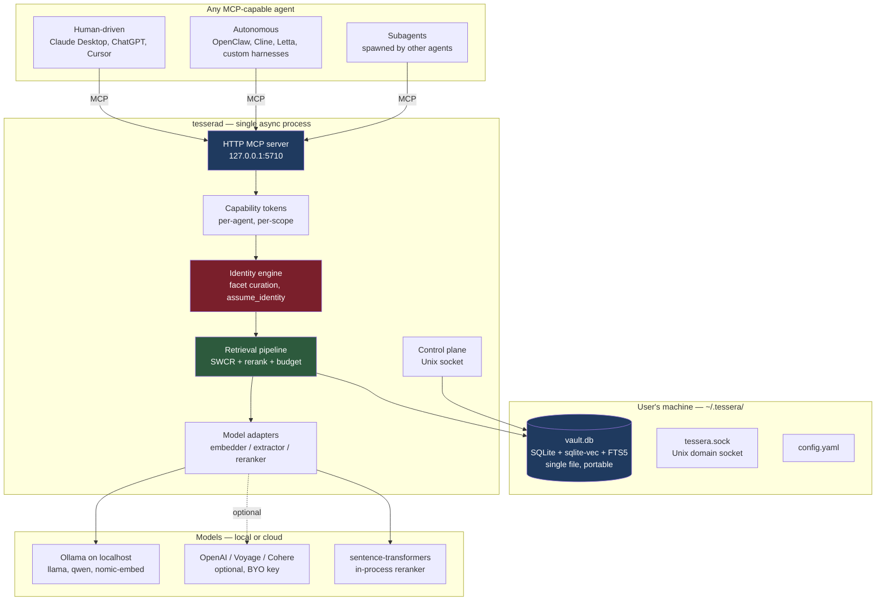
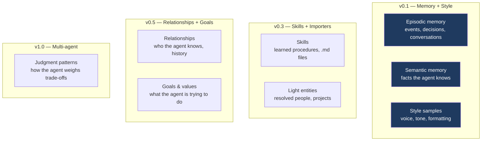
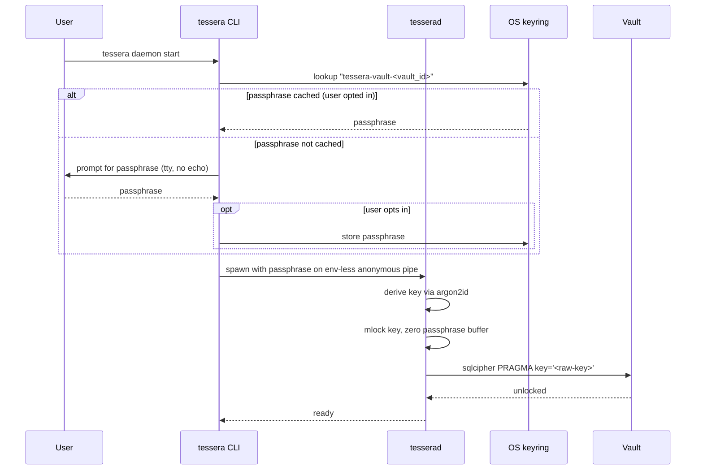
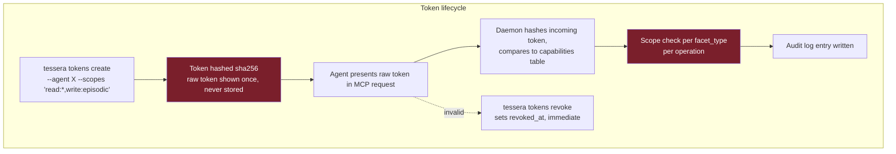
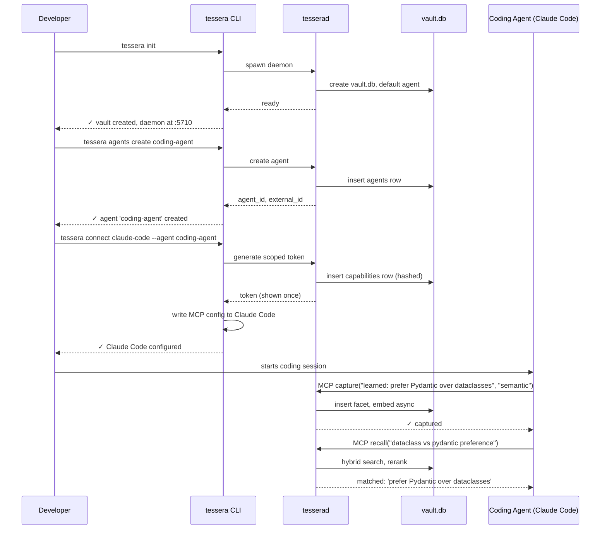
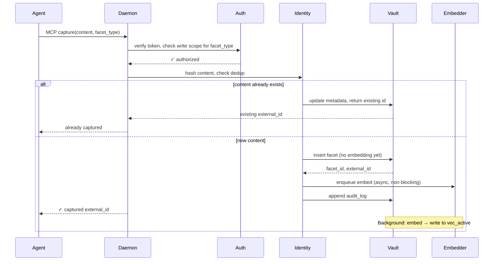
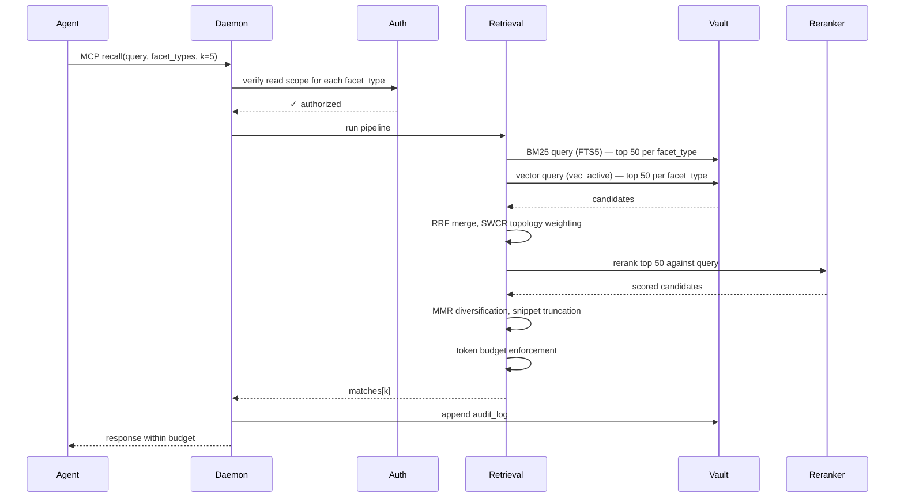
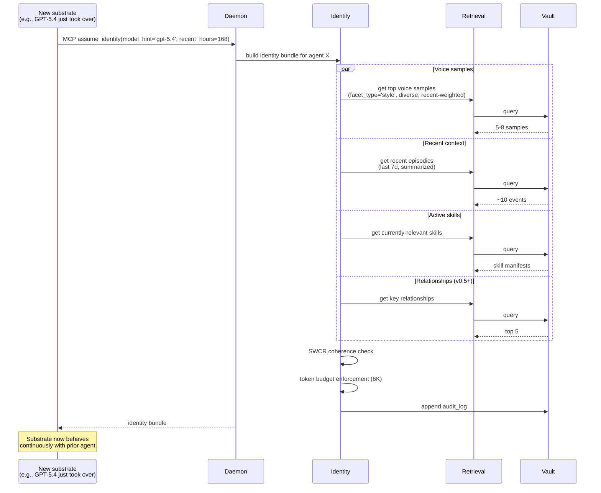
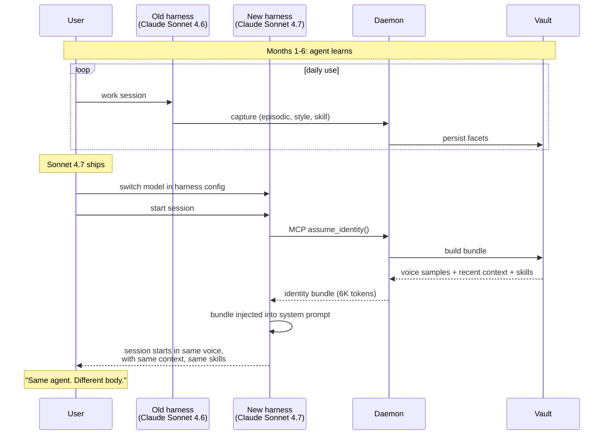

# Tessera — System Design

> _Agent identity that survives the substrate._

**Status:** Draft 1
**Date:** April 2026
**Owner:** Tom Mathews
**License:** Apache 2.0

---

## Architecture overview

Tessera is a single async daemon (`tesserad`) that owns a single-file SQLite vault and exposes the agent's identity over MCP. Agents — autonomous or human-driven — connect with scoped capability tokens and read/write identity through a small, opinionated tool surface. The model that powers any given agent is a swappable substrate; the vault is the persistent layer.



The hot path: agent calls MCP tool → daemon authenticates token → identity engine determines what facets to fetch → retrieval pipeline runs hybrid search + rerank with token budget → response streamed back.

## Identity model

Agent identity is not flat. Tessera models it as seven distinct facets, each with its own storage, retrieval, and lifecycle characteristics. Versions ship facets incrementally:



Why this decomposition matters: existing memory products treat memory as a single fact-store. They handle EPI and SEM, partially. Nobody handles STYLE as a first-class facet, which is exactly the rupture point in substrate changes — the agent forgets _how to sound like itself_ before it forgets the facts.

Tessera makes STYLE a v0.1 primitive because it's the demo moment.

**Why seven facets, why these seven, and why a closed set** — see [ADR 0004](adr/0004-seven-facet-identity-model.md) for the orthogonality analysis, overlap resolutions, and rejected alternatives (flat fact store, two-class episodic/semantic split, open-ended facet types).

## Storage primitives

Single-file SQLite, three storage primitives:

| Primitive         | Purpose                                      | Engine                                               |
| ----------------- | -------------------------------------------- | ---------------------------------------------------- |
| Relational tables | Identity facets, agents, capabilities, audit | SQLite core                                          |
| Vector indexes    | Semantic recall over content & style         | `sqlite-vec` (one virtual table per embedding model) |
| Full-text indexes | BM25 keyword recall                          | SQLite FTS5 (porter unicode61)                       |

Why one file: portability is the ideology. The user can `cp vault.db ~/Dropbox/`. Back it up. Inspect the schema with any SQLite browser (content pages are encrypted; see §Encryption at rest). No Docker, no Postgres, no Qdrant, no daemon-hosted mystery state. The vault _is_ the agent.

Why per-model vec tables: `sqlite-vec` virtual tables fix the dim at creation. Switching embedders means creating a new vec table and lazily re-embedding. This is what makes "swap the model, keep the agent" actually work at the storage layer — old embeddings stay queryable until pruned, never destructively migrated. Full transition semantics in §Embedder-swap consistency.

## Encryption at rest

The vault contains the agent's entire identity — episodic content that may incidentally include credentials, proprietary context, or personal data. Portability is a feature; portability of plaintext is a liability. Tessera encrypts the vault at rest by default.

### Primitive

- **Cipher:** sqlcipher 4.x (SQLite page-level AES-256-GCM) as the reference implementation. Alternative: libsodium `secretbox` (XChaCha20-Poly1305) for environments where sqlcipher is unavailable, applied at the export boundary rather than per-page.
- **Key derivation:** argon2id (memory 64 MiB, iterations 3, parallelism 4) from user passphrase. Parameters versioned in `_meta.kdf_version` to allow future strengthening without breaking existing vaults.
- **Unlock key lifetime:** held in `mlock`'d memory for the daemon lifetime. Cleared on daemon stop. Not swapped, not core-dumped (`RLIMIT_CORE=0`, `PR_SET_DUMPABLE=0` on Linux).

### Unlock flow



**Passphrase transport to daemon**: anonymous pipe, not env var or CLI argument. Env vars and argv are visible to `T3` (co-located processes) via `/proc/<pid>/environ` and `/proc/<pid>/cmdline`.

### Absent passphrase

- **First run (`tessera init`)**: mandatory passphrase setup. Warn if fewer than 12 characters. Confirm by re-entry. No "skip encryption" option in v0.1.
- **Subsequent runs, no keyring entry, non-interactive shell**: daemon refuses to start and exits with clear diagnostic. No plaintext fallback.
- **Forgotten passphrase**: recovery is only possible from a user-managed backup (the encrypted vault + separately-stored recovery phrase, if the user generated one). Tessera does not escrow keys. Documented as a hard trade-off.

### Rotation

- `tessera vault rekey` re-derives the key from a new passphrase and rewrites the vault. Requires exclusive daemon lock; daemon is taken offline for the duration.
- KDF parameter upgrades (e.g., argon2id memory from 64 MiB → 256 MiB) are covered by the same rekey operation; `_meta.kdf_version` is bumped in the same transaction.

### What encryption does and does not cover

- **Covered**: All SQLite pages (relational tables, FTS5 indexes, `sqlite-vec` virtual-table data under sqlcipher). `audit_log` rows. Any backup copy of `vault.db`.
- **Not covered** (by design): the vault file's existence, size, and modification time. Filesystem metadata is leaked to anyone with directory access. Documented; users seeking stronger posture place the vault on an encrypted filesystem.
- **Not covered** (mitigations tracked separately): the daemon's in-memory working set while unlocked. See `docs/threat-model.md §S3`.

### Interaction with portability

The "cp vault.db, share it" affordance remains true — the ciphertext file is self-contained. The recipient must have the passphrase. Sharing across machines requires explicit passphrase transfer; this is the intended friction. Documentation warns against ever sharing a passphrase in the same channel as the ciphertext.

## Vault schema (v0.1)

```sql
PRAGMA foreign_keys = ON;
PRAGMA journal_mode = WAL;

-- Agents are first-class. Multiple agents can share one vault.
CREATE TABLE agents (
  id              INTEGER PRIMARY KEY,
  external_id     TEXT NOT NULL UNIQUE,             -- ULID
  name            TEXT NOT NULL,                    -- 'my-coding-agent', 'research-companion'
  created_at      INTEGER NOT NULL,
  metadata        TEXT NOT NULL DEFAULT '{}'        -- JSON
);

-- Identity facets — tagged by type. v0.1 ships episodic, semantic, style.
CREATE TABLE facets (
  id              INTEGER PRIMARY KEY,
  external_id     TEXT NOT NULL UNIQUE,             -- ULID, exposed via MCP
  agent_id        INTEGER NOT NULL REFERENCES agents(id),
  facet_type      TEXT NOT NULL CHECK (facet_type IN
                    ('episodic', 'semantic', 'style', 'skill',
                     'relationship', 'goal', 'judgment')),
  content         TEXT NOT NULL,
  content_hash    TEXT NOT NULL,                    -- sha256 of normalized content
  source_client   TEXT NOT NULL,                    -- which agent harness wrote this
  captured_at     INTEGER NOT NULL,
  metadata        TEXT NOT NULL DEFAULT '{}',       -- JSON: type-specific fields
  is_deleted      INTEGER NOT NULL DEFAULT 0,
  deleted_at      INTEGER,
  UNIQUE(agent_id, content_hash)
);

CREATE INDEX facets_agent_type   ON facets(agent_id, facet_type, captured_at DESC)
                                 WHERE is_deleted = 0;
CREATE INDEX facets_captured     ON facets(captured_at DESC) WHERE is_deleted = 0;

-- Full-text index over facet content
CREATE VIRTUAL TABLE facets_fts USING fts5(
  content,
  content=facets,
  content_rowid=id,
  tokenize='porter unicode61'
);

-- Embedding model registry — supports multi-model coexistence
CREATE TABLE embedding_models (
  id          INTEGER PRIMARY KEY,
  name        TEXT NOT NULL UNIQUE,                -- 'ollama/nomic-embed-text'
  dim         INTEGER NOT NULL,
  added_at    INTEGER NOT NULL,
  is_active   INTEGER NOT NULL DEFAULT 0           -- exactly one row has this set
);

-- One vec table per embedding model, created dynamically:
--   CREATE VIRTUAL TABLE vec_<id> USING vec0(
--     facet_id INTEGER PRIMARY KEY,
--     embedding FLOAT[<dim>]
--   );

-- Capability tokens — scoped per agent, per facet type, per operation
CREATE TABLE capabilities (
  id            INTEGER PRIMARY KEY,
  agent_id      INTEGER NOT NULL REFERENCES agents(id),
  client_name   TEXT NOT NULL,                     -- 'claude-desktop', 'cline', 'custom-harness'
  token_hash    TEXT NOT NULL UNIQUE,              -- sha256 of token, never the token itself
  scopes        TEXT NOT NULL,                     -- JSON: {"read": ["episodic","style"], "write": ["episodic"]}
  created_at    INTEGER NOT NULL,
  last_used_at  INTEGER,
  revoked_at    INTEGER
);

-- Append-only audit log
CREATE TABLE audit_log (
  id                  INTEGER PRIMARY KEY,
  at                  INTEGER NOT NULL,
  actor               TEXT NOT NULL,               -- client name | 'cli' | 'system'
  agent_id            INTEGER REFERENCES agents(id),
  op                  TEXT NOT NULL,               -- 'capture', 'recall', 'assume_identity', etc.
  target_external_id  TEXT,
  payload             TEXT NOT NULL DEFAULT '{}'
);
CREATE INDEX audit_at ON audit_log(at DESC);

CREATE TABLE _meta (key TEXT PRIMARY KEY, value TEXT NOT NULL);
INSERT INTO _meta VALUES ('schema_version', '1');
INSERT INTO _meta VALUES ('vault_id', /* ULID */);
```

**Design notes**

- `agents` is a first-class table. A vault can host multiple agents (a coding agent, a research agent, a writing agent — each with its own identity, possibly sharing facets through a shared namespace in v0.5).
- `facets` is the universal identity table. `facet_type` discriminates. Type-specific fields go in `metadata` JSON to keep the schema flat.
- `capabilities.scopes` is structured JSON, not a flat string. A token can grant read on `style` while denying read on `episodic` — useful when delegating a subagent that should match voice but not see private context.
- No silent deletes. `is_deleted` and `deleted_at` preserve the audit trail; `forget` operations are soft.

## MCP tool surface

Six tools. Two of them are the load-bearing ones (`recall`, `assume_identity`); the others support the lifecycle.

| Tool              | Args                                                                 | Returns                                                                        | Token budget | Notes                                                                         |
| ----------------- | -------------------------------------------------------------------- | ------------------------------------------------------------------------------ | ------------ | ----------------------------------------------------------------------------- |
| `capture`         | `content: str`, `facet_type: str`, `source: str?`, `metadata: dict?` | `{external_id, summary}`                                                       | 200          | Dedups by content hash; extracts metadata async                               |
| `recall`          | `query: str`, `facet_types: list[str]? = all`, `k: int = 5`          | `{matches: [{id, snippet, facet_type, score, captured_at}], total_found}`      | 2000         | Smart default — SWCR retrieval, summary-first                                 |
| `assume_identity` | `model_hint: str?`, `recent_window_hours: int = 168`                 | `{voice_samples, recent_episodics, active_skills, key_relationships, summary}` | 6000         | The model-swap demo tool; returns the identity bundle a fresh substrate needs |
| `show`            | `id: str`, `include_metadata: bool = false`                          | full facet content + metadata                                                  | 4000         | Drill-down                                                                    |
| `list_facets`     | `facet_type: str?`, `limit: int = 10`, `since: str?`                 | array of summaries                                                             | 1000         | Browse mode                                                                   |
| `stats`           | (none)                                                               | `{total_per_facet, by_source, vault_size_bytes, active_models}`                | 500          | Corpus overview                                                               |

**Why `assume_identity` is the magic call.** When a fresh substrate spins up — new model, new harness, new session — it calls `assume_identity()` once. The vault returns a curated bundle: voice samples (how this agent writes), recent episodic context (what's been happening), active skills (what procedures the agent knows), key relationships (who the agent works with). Enough for the new substrate to behave continuously with the prior one without exhausting its context window on cold-start retrieval.

The bundle is _curated_, not dumped. Token-budgeted, with diversity enforcement. This is where SWCR's topology-aware traversal earns its weight: instead of returning the 50 nearest-neighbor facets, return the facets that _together_ reconstruct identity coherently across multiple dimensions.

## Retrieval pipeline (the load-bearing detail)

Every `recall` and `assume_identity` call runs this pipeline. No exceptions, no silent fallbacks beyond explicit degradation.

```mermaid
graph LR
  Q[Query or identity-bundle request] --> EXP[SWCR query expansion<br/>+ entity extraction]
  EXP --> CAND[Candidate generation<br/>vector + BM25 per facet type]
  CAND --> RRF[Reciprocal Rank Fusion<br/>merge to top-50]
  RRF --> TOPO[SWCR topology weighting<br/>facet-type coherence]
  TOPO --> RR[Cross-encoder rerank]
  RR --> MMR[MMR diversification<br/>λ=0.7]
  MMR --> BUDGET[Token budget enforcer<br/>snippets 256 tok max]
  BUDGET --> OUT[Response]

  style EXP fill:#7a1f2b,color:#fff
  style TOPO fill:#7a1f2b,color:#fff
  style BUDGET fill:#7a1f2b,color:#fff
```



**Hard rules (the contract)**

1. Hybrid candidate generation is mandatory across all facet types in scope. Vector-only is a bug.
2. SWCR topology weighting reorders RRF candidates by facet-type coherence — for an `assume_identity` call, this is what ensures voice samples don't crowd out recent episodics or active skills in the budget.
3. Cross-encoder reranking is mandatory. If the configured reranker fails health check, retrieval falls back to RRF order _and emits a warning to audit log_ — never silent skip.
4. Snippets are truncated to ≤ 256 tokens each.
5. Total response ≤ tool's token budget. Counted with `tiktoken cl100k_base`.
6. If candidates exhausted before `k`: return what we have, set `truncated: false`.
7. If budget exhausted before `k`: return fewer results, set `truncated: true`.

## Embedder-swap consistency

The per-model vec-table design (ADR 0003) answers _where_ old and new embeddings live during an embedder swap. This section specifies _how retrieval behaves_ during the transition. Silent on this point, a naive implementation produces either incoherent cross-space score blending or a multi-hour window where most of the vault is invisible to vector search.

### Per-facet embed tracking

The `facets` table carries an `embed_model_id` reference to the embedding used at capture time:

```sql
ALTER TABLE facets ADD COLUMN embed_model_id INTEGER REFERENCES embedding_models(id);
CREATE INDEX facets_embed_model ON facets(embed_model_id) WHERE is_deleted = 0;
```

A facet is considered _embedded in model M_ iff a row exists in `vec_<M.id>` with `facet_id = f.id`. The `facets.embed_model_id` column records the most-recent successful embed; the per-vec-table presence is the source of truth.

### Transition modes

`tessera models set embedder <name> --mode <cutover|shadow|gradual>` chooses the transition policy. Default is `shadow`.

| Mode               | Behavior during transition                                                                                                                                         | User-visible effect                                                             |
| ------------------ | ------------------------------------------------------------------------------------------------------------------------------------------------------------------ | ------------------------------------------------------------------------------- |
| `cutover`          | Block all recall until re-embed of active facets completes                                                                                                         | Longest single stall; simplest semantics                                        |
| `shadow` (default) | Query both old and new vec tables; blend by a per-space calibration factor; promote new table to active when re-embed reaches a configured threshold (default 95%) | Graceful degradation; no stall                                                  |
| `gradual`          | Query only the new table; new facets captured during transition embed into the new table; old facets re-embed in the background                                    | New captures work instantly; historical recall degraded until backfill complete |

### Shadow mode — score blending

Cross-space cosine scores are not directly comparable. Shadow mode resolves this with per-query rank fusion rather than score arithmetic:

1. Run BM25 and dense search independently against both vec tables.
2. Apply RRF across all result lists (BM25, dense-old, dense-new).
3. Pass unified candidate set to cross-encoder rerank.
4. Proceed to SWCR and downstream stages as normal.

RRF is scale-invariant, so mixing spaces in rank-space rather than score-space is the correct primitive. The reranker scores are comparable across candidates because they come from a single cross-encoder model applied to (query, snippet) pairs, regardless of which embedder surfaced the candidate.

### Progress visibility

- `tessera stats` reports per-model coverage: `{model: "voyage-3", embedded: 34210, pending: 15790, failed: 12, percent: 68.4}`.
- `tessera vault reembed [--target-model X] [--throttle N]` initiates or resumes a re-embed pass. Throttle argument caps concurrent embed calls to avoid starving live recall.
- `recall` response includes a `warnings` field when the active model has < 100% coverage: `{"warnings": ["voyage-3 coverage 68.4%; some results may be from legacy embedder"]}`.

### Completion and pruning

- Re-embed is complete when all active facets have a row in the target vec table.
- Promotion to active model is an explicit `tessera models activate <name>` operation (idempotent; no-op if already active).
- Old vec tables are not auto-dropped. `tessera vault prune-old-models [--keep-last N]` removes them; default retains the previous model for rollback.

### Failure and rollback

- A failed embed (e.g., Ollama OOM) updates `facets.metadata.embed_errors[]` with `{model_id, error, at}`. See §Failure taxonomy.
- Rollback: `tessera models activate <previous-name>` flips `is_active`. No data migration; the previous vec table is untouched during the transition.

## Model adapter framework (summary)

Three slots: embedder, extractor, reranker. Each pluggable via decorator-based registry. Reference implementations: Ollama, OpenAI, sentence-transformers. All-local mode (Ollama only) works end-to-end with zero cloud dependency. Full details in the companion `docs/model-adapters.md` document.

## Trust & capability tokens

Tessera ships with proper auth from v0.1, not as an afterthought. Every agent connects with a scoped token; no shared bearer key. Full lifecycle rationale in [ADR 0007](adr/0007-token-lifecycle.md); threats and mitigations in [`docs/threat-model.md §S2`](threat-model.md).



Token format: `tessera_<purpose>_<24-char-base32>`. Stored as `sha256(salt || token)` in `capabilities.token_hash`, where `salt` is a per-row 16-byte random value recorded alongside. Never logged, never echoed back after creation. Lost token → revoke + reissue.

### Lifetime and refresh

Tokens are short-lived by default. The capability record carries both an issuance time and an absolute expiry. `capabilities.scopes` carries the authorized operations; `capabilities.expires_at` is mandatory.

| Token class                                | Default TTL | Refresh mechanism                                        |
| ------------------------------------------ | ----------- | -------------------------------------------------------- |
| `session`                                  | 30 min      | Paired refresh token with 12 h TTL; rotates on every use |
| `service` (long-running autonomous agents) | 24 h        | Paired refresh token with 30 d TTL; rotates on every use |
| `subagent`                                 | 15 min      | No refresh; re-issued by parent agent on expiry          |

Refresh tokens are one-time-use: issuing a new bearer invalidates the refresh token used. Stolen bearer + stolen refresh is the worst case; rotation on use caps the attacker's window at one refresh cycle once the legitimate client makes a request.

### Binding (v0.3)

Tokens in v0.1 are bearer — possession equals authority. v0.3 adds two optional binding mechanisms:

- **UID binding**: token carries a hash of the OS user's UID and refuses on mismatch. Defends against another user on the same machine replaying a stolen token.
- **Client fingerprint binding**: at first use, the server records a fingerprint (user agent + a nonce the client echoes). Later presentations from a different fingerprint are rejected. Rotatable on explicit re-authorization.

Both are opt-in in v0.3. Mandatory binding for `service`-class tokens is a v1.0 consideration.

### Revocation propagation

- `tessera tokens revoke <id>` sets `revoked_at`; no in-memory cache of token validity older than 30 s is permitted anywhere in the daemon.
- Every MCP request re-checks `revoked_at` against the current time. The cost is one indexed lookup; benchmarked as negligible.
- In-flight MCP tool calls complete if they started before revocation; subsequent calls on the same session fail with a distinct `token_revoked` error so the client can re-authenticate.

### Transport

- **Unix socket is the default control-plane transport** on macOS and Linux: `$XDG_RUNTIME_DIR/tessera/tessera.sock`, mode 0600. Filesystem permissions gate access; no token required.
- **HTTP MCP** is agent-facing, bound to `127.0.0.1:<port>` (default 5710). Token travels in an `Authorization: Bearer <token>` header. CORS denied for browser origins via `Origin` header check.
- **Stdio MCP bridge** (v0.1.x) reuses the Unix-socket transport via subprocess pipes for MCP clients that cannot drive HTTP MCP.
- **URL-embedded token transport (e.g., ChatGPT Developer Mode)** is explicitly deprecated. v0.1 connects ChatGPT Dev Mode via an exchange endpoint: user pastes a one-time setup URL, the endpoint issues a session token to a localhost URL the extension reads, and the URL is invalidated after 30 s. The session token never lives in a URL the browser remembers.

### Audit coupling

Every `capabilities` mutation (issue, rotate, revoke) writes an audit-log row with the hashed token identifier, actor, and reason. Stolen-token forensics are possible by reconstructing the capability's usage history from the audit log.

Scopes are structured. A claude-desktop token might be:

```json
{
  "read": ["episodic", "semantic", "style", "skill"],
  "write": ["episodic", "semantic"]
}
```

A subagent token might be:

```json
{
  "read": ["style"],
  "write": []
}
```

Style-only read for voice continuity, no access to private memory.

## User workflow — integrating an agent with Tessera



## System workflow — capture (write path)



Capture returns immediately. Embedding happens asynchronously, so a slow embedder doesn't block the agent's tool call. If the embedder fails, the facet stays in the vault but is excluded from semantic search until re-embed succeeds.

## System workflow — recall (read path)



## System workflow — `assume_identity` (the model-swap demo)

This is the signature flow. A fresh substrate spinning up calls `assume_identity` once and gets back the curated bundle it needs to behave as the prior agent.



**Why this isn't just "a big recall."** A naive implementation would just return the top-K facets across all types. That fails because:

- Voice samples don't help if they're crowded out by 40 episodic events
- Recent context doesn't help if no voice samples make it through
- Skills don't help if their pre-conditions aren't loaded

SWCR enforces _coherence across facet types_, not just relevance. The bundle is constructed to be self-consistent: voice that matches recent context, skills that match the relationships present, episodics that ground the active goals. This is the dissertation work made operational.

## System workflow — model swap (end-to-end demo)

The story arc that makes the product real. From the user's perspective:



## Failure taxonomy

Tessera degrades loudly, never silently. Every failure class has a classification, a user-visible surface, and a recovery path. The taxonomy is operational; corresponding threat-level risks live in `docs/threat-model.md`.

### Schema additions

```sql
ALTER TABLE facets
  ADD COLUMN embed_status TEXT NOT NULL DEFAULT 'pending'
    CHECK (embed_status IN ('pending', 'embedded', 'failed', 'stale')),
  ADD COLUMN embed_attempts INTEGER NOT NULL DEFAULT 0,
  ADD COLUMN embed_last_error TEXT,
  ADD COLUMN embed_last_attempt_at INTEGER;

CREATE INDEX facets_embed_status
  ON facets(embed_status, embed_last_attempt_at)
  WHERE is_deleted = 0 AND embed_status IN ('pending', 'failed');
```

| `embed_status` | Meaning                                                                            |
| -------------- | ---------------------------------------------------------------------------------- |
| `pending`      | Facet captured; not yet embedded. Eligible for next worker pass.                   |
| `embedded`     | Row present in active `vec_*` table with matching `facet_id`.                      |
| `failed`       | Retry cap exhausted. Requires user action (`tessera vault repair-embeds`).         |
| `stale`        | Embedded under a prior active model; pending re-embed to the current active model. |

### Retry policy

| Failure class             | Detection                                     | Action                                                                                                                   |
| ------------------------- | --------------------------------------------- | ------------------------------------------------------------------------------------------------------------------------ |
| Embedder network error    | Adapter-reported timeout / connection refused | Exponential backoff (5 s, 30 s, 2 min); 3 attempts; on exhaustion, `embed_status='failed'`, emit event                   |
| Embedder OOM              | Adapter-reported resource error               | Same backoff; alert eagerly; after 3 failures, surface warning at next `stats()`                                         |
| Embedder model not loaded | Ollama 404 on model                           | Attempt `ollama pull` once; if fails, mark `failed` + emit event with recovery hint                                      |
| Rerank model load failure | sentence-transformers throws                  | Fall back to RRF order, set `rerank_degraded=true` in response, write event; retry reranker on next call (cold-load)     |
| Rerank per-query failure  | Exception during scoring                      | Fall back to RRF order for that call only; write event                                                                   |
| SQLite busy / locked      | OperationalError on write                     | Exponential backoff (50 ms–500 ms); fail the MCP call on exhaustion; the capture is the client's responsibility to retry |
| Integrity check failure   | `PRAGMA integrity_check` on daemon start      | Refuse to serve; prompt user to `tessera doctor` and consider backup restore                                             |

### User-visible surfaces

- **`stats()` response** includes an `embed_health` block: `{pending: N, failed: N, stale: N, last_failure: {...}}`.
- **`recall()` response** includes a `warnings` array when (a) > 5% of requested facet types have `pending`/`failed` status, or (b) the reranker ran in degraded mode, or (c) re-embedding coverage under the active model is below 100%.
- **`capture()` response** is always synchronous; embed happens async. The response shape is unchanged regardless of embed outcome. Embed failures surface via `stats()` and events, not via the capture response.
- **`tessera vault repair-embeds [--facet-type X]`** reprocesses facets in `failed` state, resetting `embed_attempts` and attempting fresh embeds.

### Dead-letter behavior

Failed embeds are not moved to a separate table. They remain in `facets` with `embed_status='failed'` and are invisible to the embed worker queue until an explicit `repair-embeds` call resets them. This keeps the vault single-table-per-concern and leverages the existing FK graph.

## Deployment model

| Aspect        | v0.1                                                                                                                           |
| ------------- | ------------------------------------------------------------------------------------------------------------------------------ |
| Install       | `pip install tessera` or `uv tool install tessera`. macOS: `brew install tessera` (post v0.1)                                  |
| Process model | Single async Python daemon. No Docker. No external services.                                                                   |
| OS support    | macOS, Linux first-class. Windows via pip.                                                                                     |
| Auto-start    | `launchd` (macOS), systemd user unit (Linux), manual on Windows                                                                |
| Network       | Listens on `127.0.0.1:5710` (HTTP MCP) and Unix socket (control plane). No outbound calls except to configured model adapters. |
| Telemetry     | None. Verified by source review and CI grep check.                                                                             |
| Updates       | Standard `pip install -U tessera`. Semver-versioned. Vault schema migrations are explicit and reviewable.                      |

## What's deferred (for honesty)

The following are explicitly NOT in v0.1 even though they could be:

| Deferred                                             | Rationale                                                                         | Target version |
| ---------------------------------------------------- | --------------------------------------------------------------------------------- | -------------- |
| Skills (Letta-style)                                 | Need a real user to ship before designing the abstraction                         | v0.3           |
| Importers (ChatGPT, Claude project export, Obsidian) | Each importer is a small project; v0.1 ships before any                           | v0.3           |
| Episodic temporal queries                            | Episodic exists; temporal-aware retrieval is harder                               | v0.5           |
| BYO cloud sync (S3, B2, Tigris)                      | Architecturally simple but adds surface area                                      | v0.5           |
| Web/desktop UI                                       | Violates "the product disappears" until proven necessary                          | v1.0 if ever   |
| Multi-agent shared facets / namespaces               | Adds permissions complexity                                                       | post-1.0       |
| Hosted sync service                                  | Requires running infrastructure for users — not a solo-dev v0.1 problem           | v1.0 if ever   |
| Auto-capture (clipboard, screen)                     | **Never.** Ideology bar — the user/agent decides what to capture, not the daemon. | never          |

This list is the discipline. It is what prevents Tessera from accumulating Mem0's surface area while having one developer.

## Open architectural questions

These are the things that need either prototyping or a real user to settle. Not dishonest to ship v0.1 with these unresolved:

1. **Style-sample format.** Are voice samples raw text snippets, or structured (tone descriptors + example sentences)? My instinct: raw snippets in v0.1, structured in v0.3 if usage suggests it.
2. **Cross-agent facet sharing.** When two agents in one vault should share semantic facts but not episodic, what's the permission model? Defer to v0.5; in v0.1, vaults are single-agent in practice.
3. **Skill format.** Letta uses `.md` files in a `.skills/` directory. Tessera could do the same, or store skills in the vault. Trade-off: file-based is git-versionable; vault-based is queryable. Probably a hybrid — store in vault, syncable to disk.
4. **Reranker model selection per facet type.** A reranker tuned for code might be wrong for voice samples. v0.1 ships one reranker; v0.3 may need per-facet rerankers.

---

## Reading next

- **Release Spec** — what ships in each version, with definition of done
- **Model Adapters** — the three-slot adapter framework, in depth
- **Pitch** — the share-with-colleagues version
