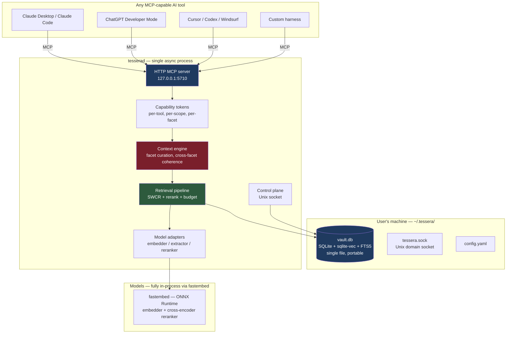
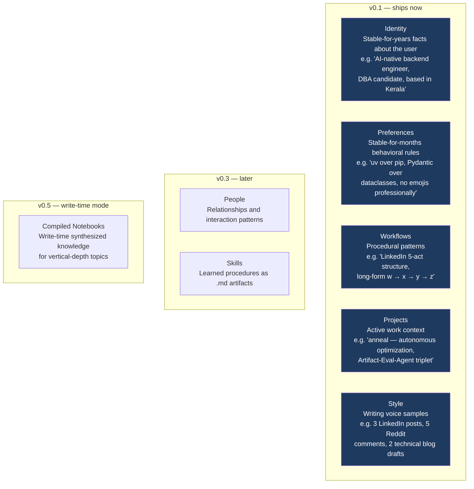
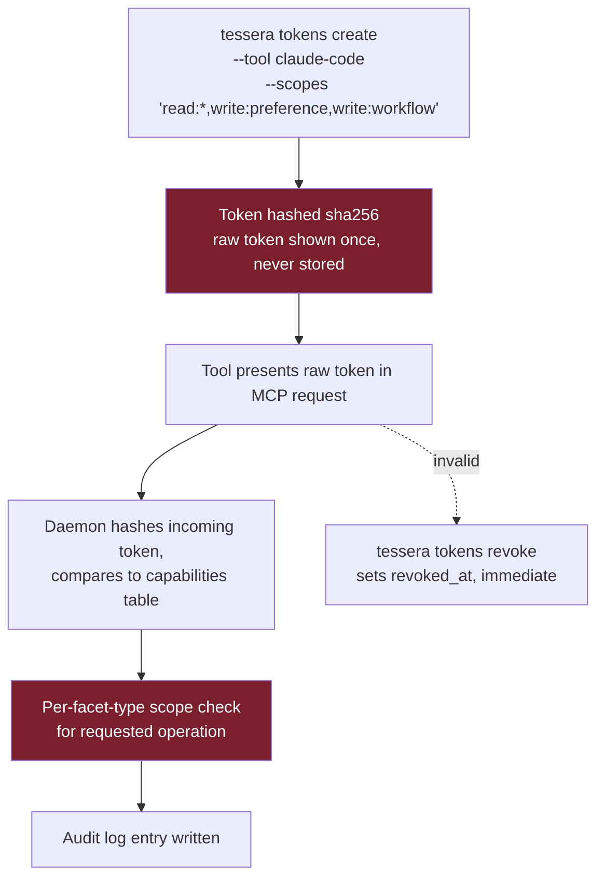
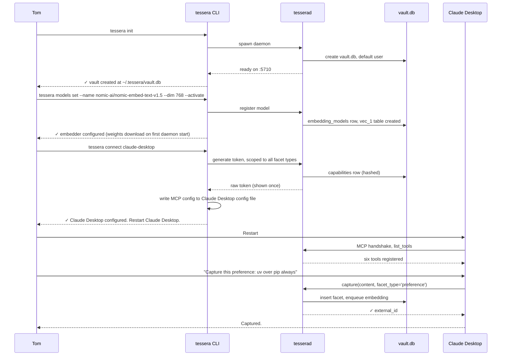
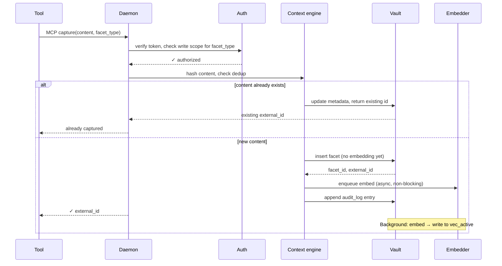
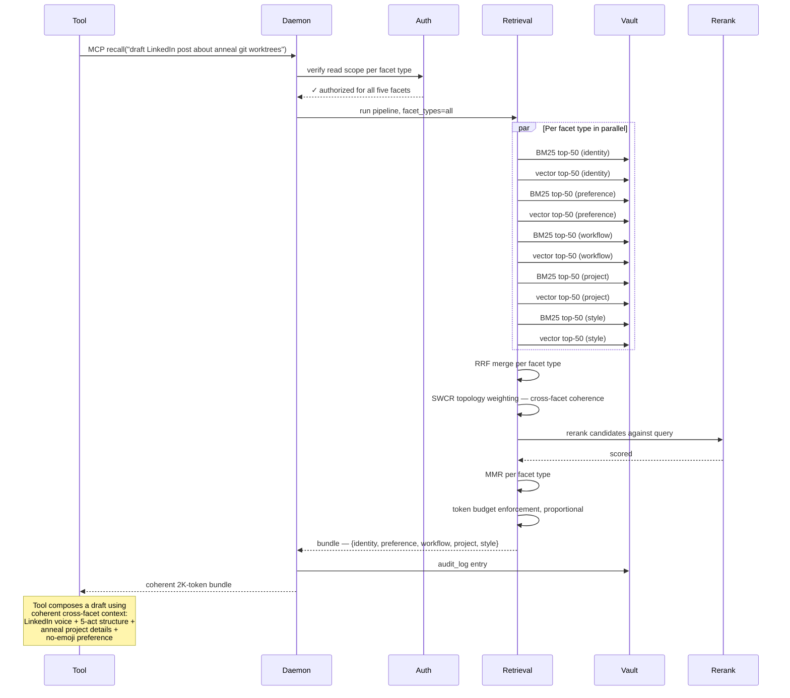
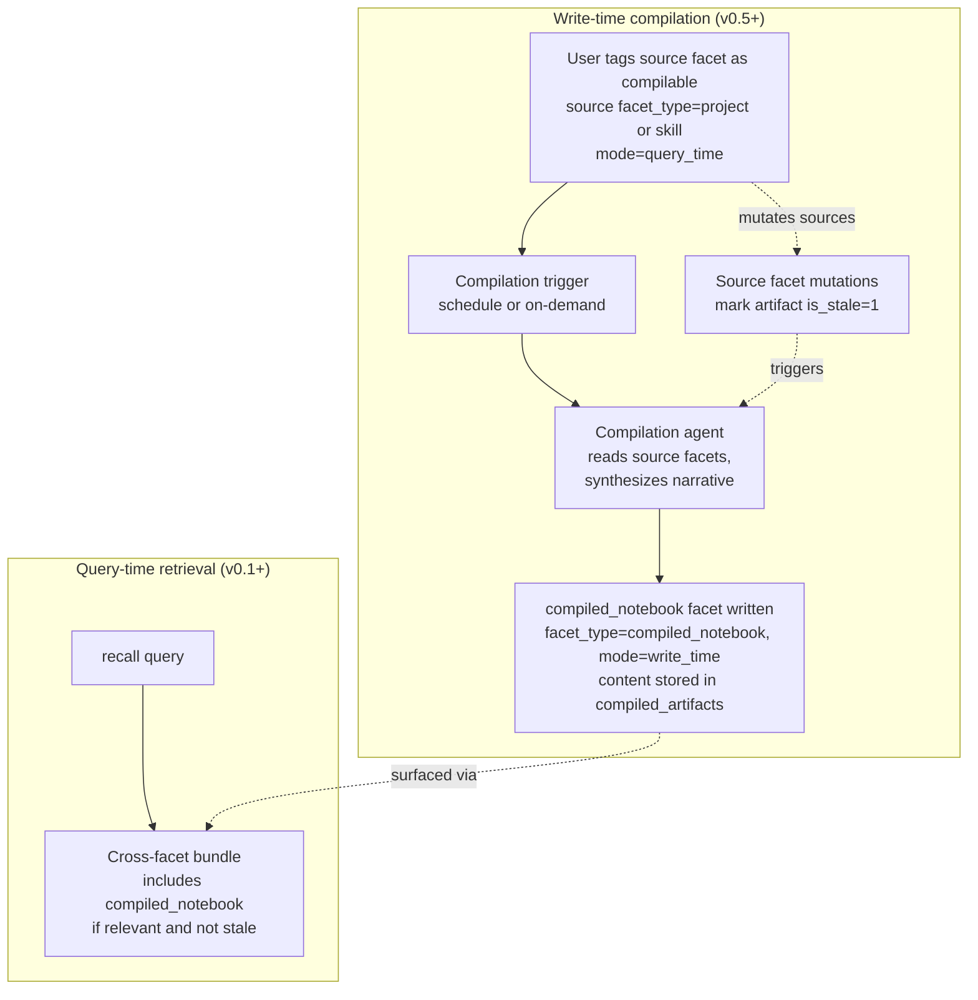

# Tessera — System Design

> *A portable context layer for AI tools.*

**Status:** Draft (post-reframe)
**Date:** April 2026
**Owner:** Tom Mathews
**License:** Apache 2.0

---

## Architecture overview

Tessera is a single async daemon (`tesserad`) that owns a single-file SQLite vault and exposes the user's context over MCP. AI tools connect with scoped capability tokens and read/write context through a small, opinionated tool surface. The models powering those tools are swappable substrates; the vault is the persistent layer.



Hot path: AI tool calls MCP → daemon authenticates token and filters to the facet types the token grants (static, per-tool) → context engine narrows to the query-relevant subset of those granted types (dynamic, per-query) → retrieval pipeline runs hybrid search + SWCR coherence weighting + rerank + token budget → response returned.

## The five-facet context model

Context is not flat. Flat-blob memory stores are why existing products return nearest-neighbor facts instead of usable context bundles. Tessera models context as five facets, each with its own storage characteristics, retrieval patterns, and lifecycle.



Why five, not more: every facet added to v0.1 is another model the user has to learn and another dimension the retrieval has to weight. Five is the minimum that covers the T-shape cleanly. Expansion to seven happens in v0.3 when People and Skills earn their spot based on real usage.

Why these five specifically: they map directly to the three levels of user context (identity / preferences / workflows) plus the two active-state facets (projects / style) that the T-shaped user needs in almost every real query.

## Storage primitives

Single-file SQLite, three storage primitives:

| Primitive | Purpose | Engine |
|---|---|---|
| Relational tables | Facets, users, tools, capability tokens, audit log | SQLite core |
| Vector indexes | Semantic recall across facet content | `sqlite-vec` (one virtual table per embedding model) |
| Full-text indexes | BM25 keyword recall | SQLite FTS5 (`porter unicode61`) |

The vault is a single file. The user can `cp` it to Dropbox. Email it. Inspect it with any SQLite browser. This is the whole ideology made tangible — the file *is* the product.

Per-model vec tables: `sqlite-vec` virtual tables fix the dim at creation. Switching embedders creates a new vec table and lazily re-embeds. This is what makes "swap your embedding model without losing data" actually work. Old embeddings stay queryable until pruned; never destructively migrated.

## Vault schema (v0.1, with v0.5 hooks)

```sql
PRAGMA foreign_keys = ON;
PRAGMA journal_mode = WAL;

-- The user owns the vault; multi-user is post-1.0.
-- This table exists to make the ownership explicit and to future-proof.
CREATE TABLE users (
  id              INTEGER PRIMARY KEY,
  external_id     TEXT NOT NULL UNIQUE,              -- ULID
  name            TEXT NOT NULL,
  created_at      INTEGER NOT NULL,
  metadata        TEXT NOT NULL DEFAULT '{}'         -- JSON
);

-- The load-bearing table. Every facet is a row here.
CREATE TABLE facets (
  id              INTEGER PRIMARY KEY,
  external_id     TEXT NOT NULL UNIQUE,              -- ULID, exposed via MCP
  user_id         INTEGER NOT NULL REFERENCES users(id),
  facet_type      TEXT NOT NULL CHECK (facet_type IN
                    ('identity', 'preference', 'workflow',
                     'project', 'style',
                     -- reserved for v0.3+
                     'person', 'skill',
                     -- reserved for v0.5+
                     'compiled_notebook')),
  content         TEXT NOT NULL,
  content_hash    TEXT NOT NULL,                     -- sha256 of normalized content
  mode            TEXT NOT NULL DEFAULT 'query_time'
                    CHECK (mode IN ('query_time', 'write_time', 'hybrid')),
  source_tool     TEXT NOT NULL,                     -- which tool captured this
  captured_at     INTEGER NOT NULL,
  metadata        TEXT NOT NULL DEFAULT '{}',        -- JSON: type-specific fields
  is_deleted      INTEGER NOT NULL DEFAULT 0,
  deleted_at      INTEGER,
  -- ADR 0016 (V0.5-P1): orthogonal lifecycle on every row. Default is
  -- 'persistent' so existing data and v0.4 callers are unchanged.
  -- Non-persistent rows carry a TTL in seconds (or NULL when the
  -- row defers to the volatility default — 24 h for session, 60 min
  -- for ephemeral) and are auto-compacted via soft-delete after the
  -- window elapses.
  volatility      TEXT NOT NULL DEFAULT 'persistent'
                    CHECK (volatility IN ('persistent', 'session', 'ephemeral')),
  ttl_seconds     INTEGER,
  UNIQUE(user_id, content_hash)
);

CREATE INDEX facets_user_type  ON facets(user_id, facet_type, captured_at DESC)
                               WHERE is_deleted = 0;
CREATE INDEX facets_captured   ON facets(captured_at DESC) WHERE is_deleted = 0;
CREATE INDEX facets_mode       ON facets(mode, facet_type) WHERE is_deleted = 0;
-- Partial index drives the auto-compaction sweep without touching the
-- (much larger) persistent partition of the table.
CREATE INDEX facets_volatility_sweep
              ON facets(volatility, captured_at)
              WHERE is_deleted = 0
                AND volatility IN ('session', 'ephemeral');

-- Full-text index over content
CREATE VIRTUAL TABLE facets_fts USING fts5(
  content,
  content=facets,
  content_rowid=id,
  tokenize='porter unicode61'
);

-- Embedding model registry; supports multi-model coexistence.
CREATE TABLE embedding_models (
  id          INTEGER PRIMARY KEY,
  name        TEXT NOT NULL UNIQUE,                  -- 'nomic-ai/nomic-embed-text-v1.5'
  dim         INTEGER NOT NULL,
  added_at    INTEGER NOT NULL,
  is_active   INTEGER NOT NULL DEFAULT 0             -- exactly one row has this set
);

-- One vec table per embedding model, created dynamically:
--   CREATE VIRTUAL TABLE vec_<id> USING vec0(
--     facet_id INTEGER PRIMARY KEY,
--     embedding FLOAT[<dim>]
--   );

-- Reserved for v0.5 write-time mode. v0.1 ships this table empty but present,
-- so adopting write-time is a feature addition, not a schema migration.
CREATE TABLE compiled_artifacts (
  id              INTEGER PRIMARY KEY,
  external_id     TEXT NOT NULL UNIQUE,
  user_id         INTEGER NOT NULL REFERENCES users(id),
  source_facets   TEXT NOT NULL,                     -- JSON array of facet external_ids
  artifact_type   TEXT NOT NULL,                     -- 'notebook', 'topic_summary', 'daily_brief'
  content         TEXT NOT NULL,
  compiled_at     INTEGER NOT NULL,
  compiler_version TEXT NOT NULL,
  is_stale        INTEGER NOT NULL DEFAULT 0,        -- set when source facets mutate
  metadata        TEXT NOT NULL DEFAULT '{}'
);
CREATE INDEX compiled_user_type ON compiled_artifacts(user_id, artifact_type, compiled_at DESC);

-- Capability tokens. Per-tool, per-scope, per-facet-type.
CREATE TABLE capabilities (
  id            INTEGER PRIMARY KEY,
  user_id       INTEGER NOT NULL REFERENCES users(id),
  tool_name     TEXT NOT NULL,                       -- 'claude-desktop', 'cursor', 'chatgpt'
  token_hash    TEXT NOT NULL UNIQUE,                -- sha256 of token, never the token
  scopes        TEXT NOT NULL,                       -- JSON: {"read": [facet_types], "write": [facet_types]}
  created_at    INTEGER NOT NULL,
  last_used_at  INTEGER,
  revoked_at    INTEGER
);

-- Append-only audit log.
CREATE TABLE audit_log (
  id                  INTEGER PRIMARY KEY,
  at                  INTEGER NOT NULL,
  actor               TEXT NOT NULL,                 -- tool name | 'cli' | 'system'
  user_id             INTEGER REFERENCES users(id),
  op                  TEXT NOT NULL,                 -- 'capture', 'recall', 'config_change'
  target_external_id  TEXT,
  payload             TEXT NOT NULL DEFAULT '{}'
);
CREATE INDEX audit_at ON audit_log(at DESC);

CREATE TABLE _meta (key TEXT PRIMARY KEY, value TEXT NOT NULL);
INSERT INTO _meta VALUES ('schema_version', '1');
INSERT INTO _meta VALUES ('vault_id', /* ULID */);
```

**Design notes**

- `facet_type` CHECK constraint lists all facets (v0.1 + reserved). Adding a v0.3 facet type is a small migration, not a schema rewrite.
- `mode` column is set on every facet. v0.1 always writes `query_time`. Write-time and hybrid are reserved for v0.5. The column exists now so v0.5 is an additive change.
- `volatility` column is set on every facet (V0.5-P1, ADR 0016). `persistent` is the default and what every v0.4 vault carries after the v3→v4 migration; `session` and `ephemeral` are caller opt-ins for AgenticOS Layer 4 working memory. SWCR weights freshness by a closed-form decay; an idle-time sweep soft-deletes expired rows so the audit trail captures the lifecycle.
- `agents.profile_facet_external_id` (V0.5-P2, ADR 0017) is a nullable FK pointing at the agent's canonical `agent_profile` facet. The `agents` table remains the JWT subject store; the linked facet carries the recallable profile context. The two are linked, not merged: every auth-pipeline read goes against `agents`, every recall-pipeline read goes against the facet, and a per-row scope check on `read:agent_profile` keeps one tool from observing another tool's profile metadata.
- `compiled_artifacts` table is reserved. v0.1 never writes to it. v0.5 populates it from the write-time compiler. Shipping the table empty is a 50-byte SQL cost; retrofitting it later is a migration.
- `source_tool` on every facet answers "which AI tool captured this?" — important for diagnosing bad captures later.
- Soft delete preserves audit trail; hard delete happens only via explicit `vault vacuum` command.

## MCP tool surface

Six tools. The heavy lifting is done by `recall`, which is cross-facet by default — the T-shape retrieval primitive. (The AI tool that consumes the bundle does the user-visible synthesis; `recall` assembles a coherent bundle for it to work from.)

| Tool | Args | Returns | Token budget | Notes |
|---|---|---|---|---|
| `capture` | `content: str`, `facet_type: str`, `source_tool: str?`, `metadata: dict?`, `volatility: str = 'persistent'`, `ttl_seconds: int?` | `{external_id, is_duplicate, facet_type, volatility, ttl_seconds}` | 512 | Dedups by content hash; embedding happens async. ADR-0016 lifecycle: `persistent` default; `session` and `ephemeral` callers opt in and may override the per-row TTL. |
| `recall` | `query_text: str`, `facet_types: list[str]? = all readable facets`, `k: int = 10`, `requested_budget_tokens: int?` | `{matches, warnings, degraded_reason, seed, truncated, rerank_degraded, total_tokens}` | 6000 | **Cross-facet by default.** SWCR coherence weighting. Empty/low-signal calls return no padded context and set `degraded_reason`. |
| `show` | `external_id: str` | facet snippet + provenance fields | 2048 | Drill-down |
| `list_facets` | `facet_type: str`, `limit: int = 20`, `since: int?` | array of summaries | 2048 | Browse mode |
| `stats` | (none) | `{embed_health, by_source, vault_size, active_models, facet_count}` | 1024 | Corpus overview |
| `forget` | `external_id: str`, `reason: str?` | `{external_id, facet_type, deleted_at}` | 256 | Soft delete; writes audit entry |
| `register_agent_profile` | `content: str`, `metadata: {purpose, inputs[], outputs[], cadence, skill_refs[], verification_ref?}`, `source_tool: str?`, `set_active_link: bool = true` | `{external_id, is_new, is_active_link}` | 512 | V0.5-P2 / ADR 0017. Inserts an `agent_profile` facet, validates the structured metadata, and (by default) updates `agents.profile_facet_external_id` to point at it. |
| `get_agent_profile` | `external_id: str` | `{profile: {external_id, content, purpose, inputs, outputs, cadence, skill_refs, verification_ref, captured_at, embed_status, is_active_link, truncated, token_count}}` or `{profile: null}` | 4096 | V0.5-P2. Cross-agent reads return null even when the ULID is leaked. |
| `list_agent_profiles` | `limit: int = 20`, `since: int?` | array of summaries (`external_id, purpose, cadence, skill_refs, captured_at, is_active_link`) | 4096 | V0.5-P2. Ordered by `captured_at DESC, id DESC` so the most recent registration lands first. |

**Why `recall` is the load-bearing tool.** Almost every real user query crosses facets. Drafting a LinkedIn post needs style (LinkedIn voice) + workflow (5-act) + project (what the post is about) + preference (length, no emojis). A Reddit comment needs style (Reddit register) + preference (4-sentence cap) + project (topic context). The default retrieval mode has to be cross-facet or the product doesn't land for its target user.

`facet_types` is an optional filter for the edge cases where single-facet retrieval matters (listing all style samples, pulling just preferences). Defaulting to "all" means the simple call does the right thing.

## Retrieval pipeline — cross-facet coherence weighting

Every `recall` executes this pipeline. No exceptions.


**The non-negotiable behaviors**

1. Hybrid candidate generation (vector + BM25) per facet type in scope. Vector-only is a bug.
2. SWCR topology weighting reorders the per-facet candidates for *coherence* — a style sample that matches the register of the query's project facet ranks above a style sample that doesn't. This is the dissertation work made operational. Mem0 cannot copy this by swapping a parameter.
3. Cross-encoder reranking is mandatory. If the configured reranker fails health check, pipeline falls back to RRF order *and emits a warning to audit log*. Never silent skip.
4. MMR diversification runs per facet type so the bundle has breadth within each facet.
5. Token budget distributed *proportionally by facet type in scope*. A `recall` with all five facets budgets ~400 tokens per facet; a `recall` scoped to just `style` gets the full 2K.
6. Each snippet ≤ 256 tokens.
7. If candidates exhausted before `k`: return what we have, `truncated: false`.
8. If budget exhausted before `k`: return fewer, `truncated: true`.

**`k`, the token budget, and snippet size interact.** `k` is a per-facet-type cap, not a target. The token budget is the binding constraint. With all five facets scoped and a 2000-token budget, the per-facet envelope (~400 tokens) typically fits one 256-token snippet — so all-facets `recall` surfaces roughly one snippet per facet type. Single-facet queries get the full 2000-token envelope and can fill up to `k` snippets. Snippets are atomic; the enforcer never returns a half-snippet to fill residual budget.

This is Framing X: a unified context layer where the user does not think about modes. The `mode` column on `facets` discriminates rows by **production method** (how the row was produced), not by user choice. v0.1 writes `query_time` for all five facets. v0.5 writes `write_time` for `compiled_notebook` rows produced by the compilation agent. A per-facet user-facing mode toggle on existing facet types is not a v0.5 commitment — if real user signal calls for it post-v0.5, it becomes a later decision.

## Model adapter framework

Three slots, wired through a decorator-based registry:

- **Embedder (required).** Produces dense vectors written to `sqlite-vec`. Default: fastembed `nomic-ai/nomic-embed-text-v1.5` (768 dim). Any model in `TextEmbedding.list_supported_models()` is acceptable.
- **Extractor (optional in v0.1).** Reserved for future entity/relation extraction. v0.1 ships without an active extractor; the slot exists so v0.3 can add extraction without a schema change.
- **Reranker (required).** Health-checked at daemon startup. Default: fastembed `Xenova/ms-marco-MiniLM-L-12-v2` cross-encoder. If the configured reranker fails health check, the retrieval pipeline falls back to RRF order and emits a warning to the audit log — never a silent skip.

All-local is the only supported mode after ADR-0014. fastembed runs both adapters in-process via ONNX Runtime; there are no cloud adapters to enable, no separate model server to coordinate, no torch dependency. ADR 0008 documents the slot boundaries and swap semantics; ADR 0014 documents the v0.4 simplification that removed every non-fastembed adapter.

## Trust & capability tokens



Token format: `tessera_<purpose>_<24-char-base32>`. Stored as `sha256(token)`. Never logged, never echoed back after creation. Lost token → revoke + reissue.

Scopes are structured JSON. A Claude Desktop token for full work use:
```json
{
  "read": ["identity", "preference", "workflow", "project", "style"],
  "write": ["preference", "workflow", "project", "style"]
}
```

A ChatGPT token for drafting only (read voice, don't modify it):
```json
{
  "read": ["identity", "preference", "workflow", "project", "style"],
  "write": ["project"]
}
```

This scoping is why "any AI tool can access my context" is safe — each tool's access is explicit, revocable, and scoped to what it actually needs.

## User workflow — installing Tessera and connecting the first tool



Five commands to working state. Three minutes on a warm machine.

## System workflow — capture (write path)



Capture returns immediately. Embedding is async. If the embedder fails transiently, the facet is stored but excluded from semantic search until re-embed succeeds; BM25 still works on it.

## System workflow — recall (cross-facet T-shape bundle assembly)



## What v0.5 adds — write-time compilation for vertical depth

v0.5 introduces `compiled_notebook` as a new facet type and activates the reserved `compiled_artifacts` table. The user tags a `project` or `skill` as vertical-depth (e.g., their dissertation thread, a multi-week research topic), and a compilation agent produces a synthesized Karpathy-style artifact from those source facets.



The source `project` and `skill` facets keep `mode=query_time`. The compilation agent produces a new `compiled_notebook` facet with `mode=write_time`. The `mode` column records the production method; it is not a user-facing per-facet toggle. v0.5 does not ship a mechanism to switch an existing `project` facet's mode from `query_time` to `write_time` — compilation is the only path by which `write_time` rows enter the vault.

Critically: **the v0.1 architecture does not foreclose any of this.** The `mode` column exists. The `compiled_notebook` facet type is reserved in the CHECK constraint. The `compiled_artifacts` table exists. The retrieval pipeline already handles multi-source candidates. v0.5 adds a compiler and a scheduler. The schema is ready.

## Deployment model

| Aspect | v0.1 |
|---|---|
| Install | `pip install tessera-context` or `uv tool install tessera-context`. macOS: `brew install tessera` (v0.1.x, tap name follows GitHub repo). CLI binary remains `tessera`. |
| Process model | Single async Python daemon. No Docker. No external services. |
| OS support | macOS, Linux first-class. Windows via pip. |
| Auto-start | `launchd` (macOS), systemd user unit (Linux), manual on Windows |
| Network | `127.0.0.1:5710` (HTTP MCP) + Unix socket (control). No outbound calls except to configured model adapters. |
| Telemetry | None. Verified by source review and CI grep check (`scripts/no_telemetry_grep.sh`). |
| Updates | Standard `pip install -U tessera-context`. Semver. Vault schema migrations are explicit and reviewable. |

## What's deferred (honest scope discipline)

| Deferred | Reason | Target version |
|---|---|---|
| People facet | Needs real usage to design relationship schema | v0.3 |
| Skills facet | Needs usage to design vs. Letta/armory-style procedures | v0.3 |
| Importers (ChatGPT export, Claude export, Obsidian) | Each is a small project; v0.1 ships before any | v0.3 |
| Write-time compiled notebooks | Vertical-depth mode; needs v0.1 users to shape the compiler | v0.5 |
| BYO cloud sync (S3, B2, Tigris) | Architecturally simple but adds surface | v0.5 |
| Web/desktop UI | Violates "the product disappears" | v1.0 if ever |
| Multi-user vaults | Permission complexity | post-1.0 |
| Hosted sync service | Solo-dev cannot run user-facing infrastructure | v1.0 if ever |
| Auto-capture (clipboard, screen, keylog) | **Never.** The user/tool decides what to capture, not the daemon. | never |

## Open architectural questions

Things that should wait for v0.1 user signal, not be settled now:

1. **Facet weighting for cross-facet queries.** Does Style outrank Project for a "draft" query but not a "plan" query? v0.1 uses SWCR coherence without explicit per-query-type weights; v0.3 may need the distinction.
2. **Per-facet reranker selection.** A reranker tuned for code might be wrong for voice samples. v0.1 ships one reranker; v0.3 may need per-facet ones.
3. **Compiled-artifact invalidation granularity.** When source facets mutate, is `is_stale=1` sufficient, or do we need partial invalidation? v0.5 problem.
4. **Write-time compilation trigger model.** Cron schedule, on-demand, or mutation-pressure-based? Defer until v0.5 user feedback.

---

## Reading next

- **Release Spec** — what ships in v0.1, v0.1.x, v0.3, v0.5, v1.0 with definition of done
- **System Overview** — strategic context, market, moat
- **Pitch** — the shareable version
- `docs/swcr-spec.md` — the algorithm behind SWCR
- `docs/threat-model.md` — security model
- `docs/migration-contract.md` — vault migration safety
